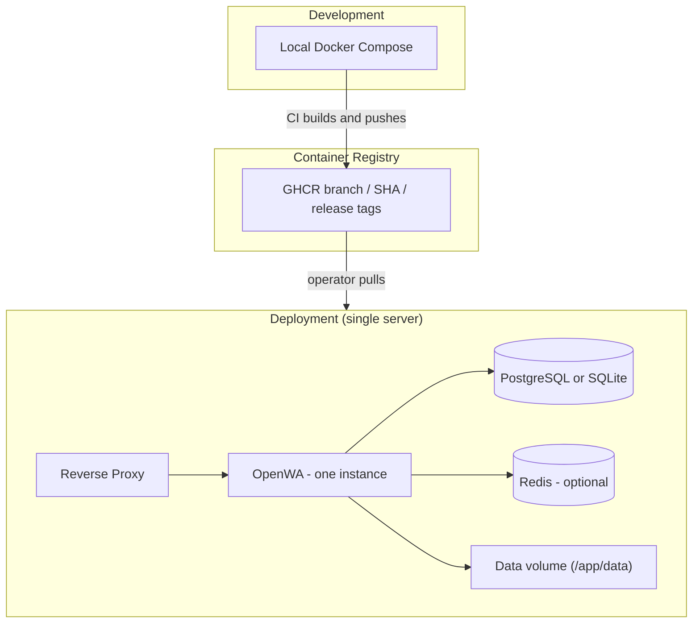
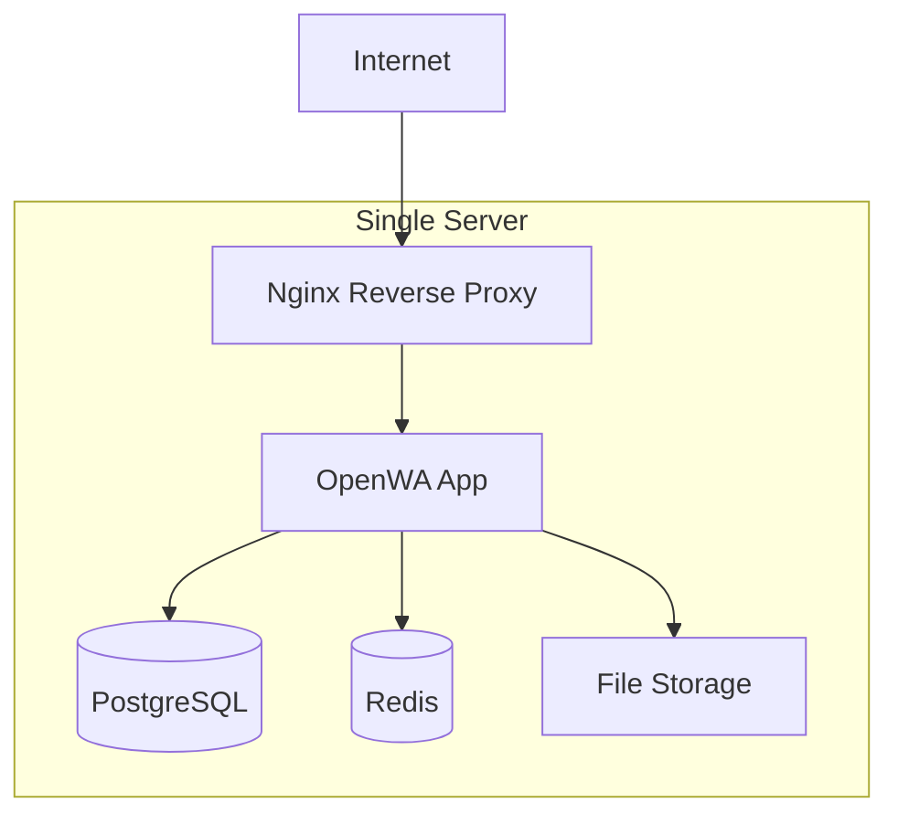
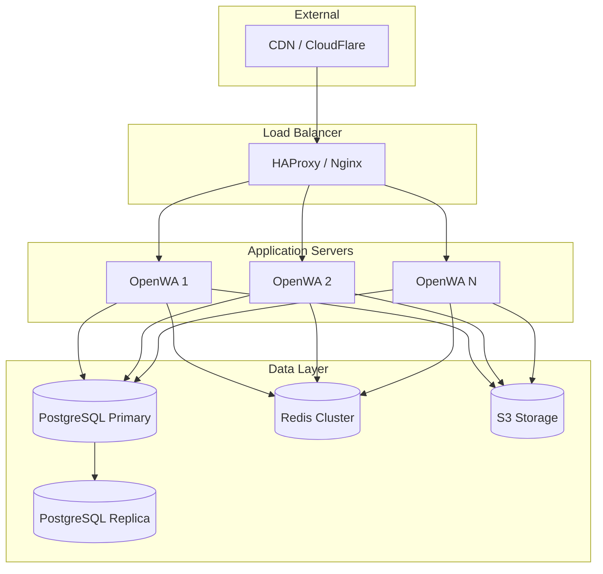
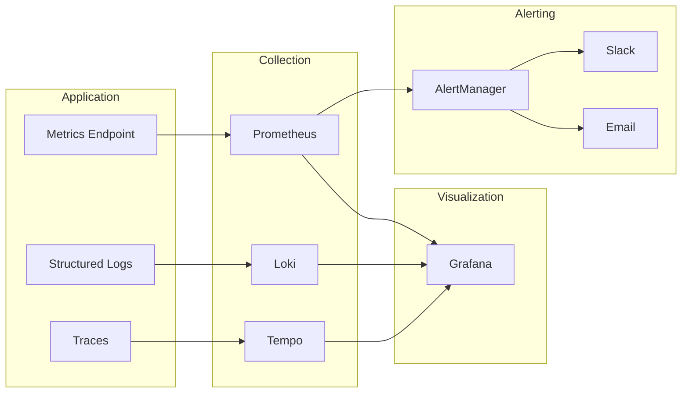
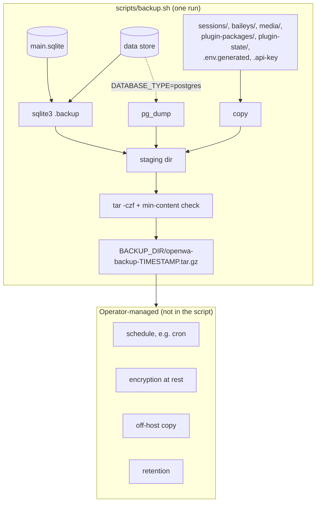

# 10 - DevOps & Infrastructure

> **⚠️ Conceptual reference.** Some examples here predate the shipped runtime and may not
> match it exactly. The **authoritative** sources are the repo's `Dockerfile`, `docker-compose.yml`
> (Docker socket-proxy threat model, gosu non-root drop, loopback-bound datastores, container
> hardening), and `.env.example` (canonical env var names). Where this doc and those disagree,
> the files win. In particular: the API master key env is `API_MASTER_KEY`, datastores have no
> default credentials, and production migrations use `npm run migration:run:prod`.

## 10.1 Infrastructure Overview

OpenWA is a **single-process** application, so a deployment is exactly one app instance per
session-data volume (`replicas: 1` — see §10.2). The repo has no staging/production environments and
no auto-deploy: CI builds and publishes images, and pulling one onto a server is the operator's step.



## 10.2 Docker Configuration

### Dockerfile

The repo `Dockerfile` is the source of truth; this section quotes the directives that matter
rather than a second full copy. It is a two-stage build on a digest-pinned `node:22-slim`:

```dockerfile
# Builder stage. --include=dev is required: a platform that leaks NODE_ENV=production into the
# build (Coolify does) would otherwise skip @nestjs/cli and fail with `nest: not found`.
RUN PUPPETEER_SKIP_DOWNLOAD=true npm ci --include=dev
RUN npm run build && npm run dashboard:ci -- --include=dev && npm run dashboard:build && rm -f dist/*.tsbuildinfo

# Production stage: runtime dependencies only, without install scripts; the dependency patchers
# run in the same RUN, and any one failing fails the build.
RUN npm ci --omit=dev --ignore-scripts \
    && node scripts/patch-wwebjs-201832.js \
    # ... one `&& node scripts/patch-*.js \` line per patcher ...
    && npm cache clean --force

HEALTHCHECK --interval=30s --timeout=10s --start-period=30s --retries=3 \
    CMD curl -f http://localhost:2785/api/health/ready || exit 1

# dumb-init is PID 1; the entrypoint runs as root, fixes /app/data ownership, then drops to the
# openwa user with gosu before it execs the command.
ENTRYPOINT ["dumb-init", "--", "/usr/local/bin/docker-entrypoint.sh"]
CMD ["node", "dist/main"]
```

The image deliberately has no `USER openwa` directive and no `chown -R` over `/app`: a full chown
walks every production dependency (#1045), so the entrypoint re-owns only the writable data volume
and then drops privileges. Chromium comes from Chrome for Testing on amd64 and from Debian's
`chromium` package on arm64; see the `Dockerfile` for the multi-arch build.

### Docker Compose (Development)

The repo's own `docker-compose.dev.yml` is a single-container local smoke test that runs the
**production** image against a bind-mounted `./data` — it has no source mount and no `start:dev`.
The multi-service file below is a hypothetical hot-reload variant you would write yourself under a
different name (writing it to `docker-compose.dev.yml` would overwrite the shipped file); the
`builder` target is the first stage of the repo `Dockerfile`.

```yaml
# docker-compose.hotreload.yml (write this yourself; not shipped in the repo)
version: '3.8'

services:
  app:
    build:
      context: .
      target: builder
    command: npm run start:dev
    ports:
      - '2785:2785'
    environment:
      - NODE_ENV=development
      - DATABASE_TYPE=postgres
      - DATABASE_HOST=postgres
      - DATABASE_PORT=5432
      - DATABASE_NAME=openwa
      - DATABASE_USERNAME=openwa
      - DATABASE_PASSWORD=openwa
      - REDIS_ENABLED=true
      - REDIS_HOST=redis
      - REDIS_PORT=6379
      # The env var is API_MASTER_KEY (not API_KEY_MASTER); never hardcode a key — set a
      # strong secret. Production refuses to boot with a placeholder/default.
      - API_MASTER_KEY=
      # Pins the plugin directory onto the data volume. This is also the default, so the setting is
      # belt-and-braces — it keeps working if the volume is mounted somewhere else.
      - PLUGINS_DIR=/app/data/plugins
    volumes:
      - ./:/app
      - /app/node_modules
      # Everything the app writes locally (session auth, the main (auth/audit) SQLite DB, media,
      # plugins) lives under /app/data; with DATABASE_TYPE=postgres above, the data DB does not
      - openwa-data:/app/data
    depends_on:
      - postgres
      - redis
    restart: unless-stopped

  postgres:
    image: postgres:16-alpine
    environment:
      - POSTGRES_USER=openwa
      - POSTGRES_PASSWORD=openwa
      - POSTGRES_DB=openwa
    volumes:
      - postgres-data:/var/lib/postgresql/data
    ports:
      - '127.0.0.1:5432:5432'

  redis:
    image: redis:7-alpine
    volumes:
      - redis-data:/data
    ports:
      - '127.0.0.1:6379:6379'

  # No separate dashboard service: the `app` image bundles the dashboard SPA and serves it
  # from the same port (2785) via NestJS. Open http://localhost:2785 for the UI.

volumes:
  postgres-data:
  redis-data:
  openwa-data:
```

### Docker Compose (Production)

The repo ships `docker-compose.yml` (full stack, builds the image from source) and
`docker-compose.dev.yml` (local smoke test). The file below is an image-based variant you would
write yourself for a release deployment; it mirrors the shipped compose in the part that matters —
the single `/app/data` volume that holds session auth, the main (auth/audit) SQLite DB, media and
plugins. Note the example below sets `DATABASE_TYPE=postgres`, so the **data** database lives in
PostgreSQL and needs its own backup; only with the SQLite default (what the shipped
`docker-compose.yml` leaves in place) does the data DB sit in this volume too.

```yaml
# docker-compose.release.yml (write this yourself; not shipped in the repo)
version: '3.8'

services:
  app:
    image: ghcr.io/rmyndharis/openwa:latest
    deploy:
      replicas: 1
      resources:
        limits:
          cpus: '2'
          memory: 2G
        reservations:
          cpus: '1'
          memory: 1G
    environment:
      - NODE_ENV=production
      - DATABASE_TYPE=postgres
      - DATABASE_HOST=${DATABASE_HOST}
      - DATABASE_PORT=${DATABASE_PORT}
      - DATABASE_NAME=${DATABASE_NAME}
      - DATABASE_USERNAME=${DATABASE_USERNAME}
      - DATABASE_PASSWORD=${DATABASE_PASSWORD}
      - REDIS_ENABLED=true
      - REDIS_HOST=${REDIS_HOST}
      - REDIS_PORT=${REDIS_PORT}
      - API_MASTER_KEY=${API_MASTER_KEY}
      # Pins the plugin directory onto the data volume. This is also the default, so the setting is
      # belt-and-braces — it keeps working if the volume is mounted somewhere else.
      - PLUGINS_DIR=/app/data/plugins
    volumes:
      # Session auth, the main (auth/audit) SQLite DB, media and plugins all live here — losing
      # this volume loses the linked WhatsApp sessions and the API keys.
      - openwa-data:/app/data
    healthcheck:
      test: ['CMD', 'curl', '-f', 'http://localhost:2785/api/health/ready']
      interval: 30s
      timeout: 10s
      retries: 3
    restart: always

  nginx:
    image: nginx:alpine
    ports:
      - '80:80'
      - '443:443'
    volumes:
      - ./nginx.conf:/etc/nginx/nginx.conf:ro
      - ./certs:/etc/nginx/certs:ro
    depends_on:
      - app
    restart: always

volumes:
  openwa-data:
    driver: local
```

> [!IMPORTANT]
> **Keep `replicas: 1`.** Session ownership gained claim/lease fencing (`nodeId` owner +
> `leaseExpiresAt`), which, while the holder can reach the database, bounds any two-engine overlap on
> one session to roughly one heartbeat interval instead of eliminating it — and docs/13 still says
> DO NOT run its multi-replica examples yet: a holder cut off from the database keeps its engines for
> the length of the outage, API keys and the audit log live in each node's own `main.sqlite` (a key
> created, revoked or narrowed on one node is unchanged on the others), and WebSocket rate-limit
> buckets, the unfenced liveness watchdog, bulk-batch state and MCP locality all remain per-process.
> Follow [13 - Horizontal Scaling Guide](./13-horizontal-scaling.md) for the full list and the design
> sketch. What multi-node eventually buys is engine capacity, not shared engine state: live engine
> handles live in exactly one process's `EngineRegistry` (`src/engine/engine-registry.service.ts`),
> and the hard requirements include a stable `NODE_ID` across restarts, NTP-synced clocks (lease skew
> beyond the TTL minus one heartbeat, about 40s at defaults, wrongfully transfers a session; the zone each node runs in no longer matters, since
> the Postgres data connection is pinned to UTC), sticky sessions, `TRUSTED_PROXIES` for forwarded
> calls, Redis and Postgres.

### Helm Chart (Kubernetes)

The maintained way to deploy on Kubernetes is the Helm chart at `charts/openwa/`:

```bash
helm install openwa ./charts/openwa \
  --set secretEnv.API_MASTER_KEY=$(openssl rand -base64 32)
```

It renders a single-replica StatefulSet (`replicaCount: 1` — the same constraint as
the compose warning above) with a PVC for `/app/data`, the compose hardening mirrored
(read-only rootfs, dropped capabilities, writable `emptyDir` at `/tmp`), and optional
Ingress / PodDisruptionBudget / ServiceMonitor. Configuration goes through free-form
`env` and `secretEnv` maps — any variable from `.env.example` works; see
`charts/openwa/README.md` and the inline comments in `charts/openwa/values.yaml`.
The k8s manifests in [13 - Horizontal Scaling Guide](./13-horizontal-scaling.md) are
an illustrative design sketch; the chart is the authoritative artifact.

## 10.3 CI/CD Pipeline

### GitHub Actions Workflow

`.github/workflows/ci.yml` (`name: CI`) runs on pushes and pull requests targeting `main`. It is
**integration only** — no job deploys anywhere. The final job publishes branch and SHA image
tags to GHCR; `latest` is deliberately not set there and moves only through the separate,
boot-smoke-gated release workflow.

The per-job step lists live in [docs/09 §9.6](./09-testing-strategy.md#96-ci-checks), which a spec
keeps in sync with the workflow (`src/common/docs-ci-jobs.spec.ts`). Restating them here is what let
this section rot: it described a `dashboard` job with no formatting step and a `chart` job with no
kubeconform long after both had one. What this page adds instead is the shape of the graph.

Seven jobs run in parallel with no dependencies: `lint`, `audit`, `test`, `test-postgres`,
`dashboard`, `scripts-smoke` and `chart`. `build` waits on all of them except `test-postgres`
(`needs: lint, audit, test, dashboard, scripts-smoke, chart`), and `docker` waits on `build` and
`test-postgres`, so the image is only built from a tree that passed every gate including the real
PostgreSQL run. `docker` pushes to `ghcr.io/<owner>/<repo>` on push events; fork pull requests build
both architectures without publishing.

Rollout is left to the operator — the repo has no SSH deploy step, no staging/production
environments and no auto-deploy on merge.

`.github/workflows/security-scan.yml` (`name: Scheduled Security Scan`) complements the merge-time
gates with a weekly run (Wednesdays 03:00 UTC, plus `workflow_dispatch`): it re-runs the `audit`
job's checks against the current dependency trees, failing rather than skipping when npm's audit
endpoint cannot answer (`CHECK_AUDIT_REQUIRED=1`), and the release workflow's `image-scan` against
the published `latest` image on both architectures. A newly published advisory therefore turns
something red within days instead of waiting for the next push or release. A third job,
`base-image-drift`, fails when the two `node:22-slim` FROM lines in the `Dockerfile` pin different
digests, or when the pin differs from what the tag serves today and either the tag has served that
image for 7 or more days, or for 3 or more days with the pin last changed 28 or more days ago; merge
the pending Dependabot digest refresh, or refresh both FROM lines by hand.

## 10.4 Deployment Architecture

### Single Server Deployment



### Multi-Server Deployment

> **Design sketch, not a supported topology.** OpenWA is single-process with in-memory engine state,
> so the multi-`OpenWA` fan-out below would corrupt WhatsApp auth across replicas. It is retained only
> as the target architecture once the remaining gaps listed in
> [13 - Horizontal Scaling Guide](./13-horizontal-scaling.md) are closed. Deploy with `replicas: 1`.



## 10.5 Environment Configuration

### Environment Variables

```bash
# .env — excerpt of the commonly-tuned keys. The repo's `.env.example` is the canonical,
# fully annotated list; add nothing here that does not appear there.
# Keys the dashboard manages (Dashboard > Infrastructure) are commented out with their defaults:
# an uncommented key in .env pins that value over the one the dashboard saves (see the header of
# `.env.example`). Uncomment only what you intend to manage by hand.

# ===========================================
# APPLICATION
# ===========================================
NODE_ENV=production
PORT=2785
# The global `/api` prefix is fixed in code — there is no env var for it.
LOG_LEVEL=info
LOG_FORMAT=json

# ===========================================
# DATABASE (choose one)
# ===========================================
# Option 1: SQLite (for minimal deployments)
# For SQLite, DATABASE_NAME is the database FILE PATH.
# DATABASE_TYPE=sqlite
# DATABASE_NAME=./data/openwa.sqlite

# Option 2: PostgreSQL (for production) — DATABASE_NAME is the database NAME here
# DATABASE_TYPE=postgres
# DATABASE_HOST=localhost
# DATABASE_PORT=5432
# DATABASE_NAME=openwa
# DATABASE_USERNAME=user
# DATABASE_PASSWORD=pass
# DATABASE_POOL_SIZE=20
# DATABASE_SSL=false

# ===========================================
# MEDIA STORAGE (choose one)
# ===========================================
# What the selected store holds: received status media, always, under statuses/<sessionId>/.
# Chat message media is copied there only with CHAT_MEDIA_ARCHIVE_ENABLED=true, under
# chat-media/<sessionId>/; media this account sent also needs CHAT_MEDIA_ARCHIVE_OUTBOUND=true.
# With the archive off, chat media stays inline on the message row (up to MEDIA_DOWNLOAD_MAX_BYTES),
# where GET /api/sessions/:sessionId/messages/:chatId/:messageId/media still serves it.
# On S3 every key sits under the S3_KEY_PREFIX root (default media/, so media/chat-media/...).
# While S3 has not been reachable since boot, or its credentials are missing, files go to
# STORAGE_LOCAL_PATH instead.
# The other CHAT_MEDIA_* settings (size cap, TTL, orphan sweep) are in .env.example.
# STORAGE_TYPE accepts only `local` or `s3` — env validation rejects anything else and the app
# FAILS TO BOOT ("Invalid environment configuration"). There is no silent fallback to local disk.
# Option 1: Local filesystem (default)
# STORAGE_TYPE=local
# STORAGE_LOCAL_PATH=./data/media

# Option 2: S3 (AWS) — leave S3_ENDPOINT unset; the SDK derives it from the region
# STORAGE_TYPE=s3
# S3_BUCKET=openwa
# S3_REGION=ap-southeast-1
# S3_ACCESS_KEY_ID=your-access-key
# S3_SECRET_ACCESS_KEY=your-secret-key

# Option 3: MinIO / other S3-compatible store — same STORAGE_TYPE=s3 plus an endpoint.
# Setting S3_ENDPOINT is what enables path-style addressing; there is no separate flag.
# STORAGE_TYPE=s3
# S3_ENDPOINT=http://minio:9000
# S3_BUCKET=openwa
# S3_ACCESS_KEY_ID=your-access-key
# S3_SECRET_ACCESS_KEY=your-secret-key

# One deployment per bucket and key prefix. S3_KEY_PREFIX (default media/) is the key root: give a
# second deployment with its own database its own bucket or a non-overlapping prefix (neither may
# start with the other: use siblings such as prod/ and staging/, never media/ and media/staging/).
# An overlap puts the other deployment's objects in this one's storage stats and export, and each
# one's orphan sweeps delete the other's media. The same applies to a shared STORAGE_LOCAL_PATH. Changing the prefix on a
# live deployment hides existing objects: export storage, change it, then import.
# S3_KEY_PREFIX=media/

# ===========================================
# CACHE & QUEUE
# ===========================================
# Both are opt-in and both need a reachable Redis, configured with the discrete host/port pair
# (there is no REDIS_URL). Defaults: no cache at all (CacheService is a no-op and every read falls
# through to the database — there is no in-memory tier) and inline (non-queued) dispatch.
# REDIS_ENABLED=false
# REDIS_HOST=localhost
# REDIS_PORT=6379
# REDIS_TLS=false      # true for a Redis that requires TLS (not the built-in container); every client
#                      # (cache, rate limits, queue, WebSocket fan-out) uses it. Private CA: NODE_EXTRA_CA_CERTS in the launch
#                      # environment (shell, systemd, compose environment:), not in .env
# REDIS_CACHE_DB=1     # logical database for the cache
# Redis-backed caching switches on when REDIS_ENABLED=true OR CACHE_ENABLED=true — enabling Redis
# for the queue alone therefore also enables the cache.
# CACHE_ENABLED=true
# QUEUE_ENABLED=true   # process webhooks/ingress through the BullMQ queue

# ===========================================
# WHATSAPP ENGINE
# ===========================================
# ENGINE_TYPE=baileys   # whatsapp-web.js (default) | baileys; omit to use the dashboard selection

# Session
# SESSION_DATA_PATH=./data/sessions

# Puppeteer (for whatsapp-web.js)
# Path to a system Chromium/Chrome binary. Leave unset to use the bundled browser; the Docker image sets its own.
# PUPPETEER_EXECUTABLE_PATH=/usr/bin/chromium
# PUPPETEER_HEADLESS=true
# PUPPETEER_ARGS=--no-sandbox,--disable-setuid-sandbox,--disable-dev-shm-usage,--disable-gpu
# Optional per-browser-command budget, ms. Unset = Puppeteer's own budget. Raise only after a read answers
# 503 "did not answer ... in time" or fails with "Runtime.callFunctionOn timed out"; positive integer, max
# 2147483647 (cost: see docs/12).
# PUPPETEER_PROTOCOL_TIMEOUT_MS=300000

# ===========================================
# SECURITY
# ===========================================
# First-boot seed for the initial ADMIN key, ignored once any key exists. Leave it unset to
# generate a random key into data/.api-key, or set one generated with: openssl rand -base64 32
# API_MASTER_KEY=
# Optional HMAC pepper so a DB leak alone can't precompute key hashes. Generate a random value
# (openssl rand -base64 32); setting or changing it invalidates every API key issued before.
# API_KEY_PEPPER=

# ===========================================
# WEBHOOK
# ===========================================
WEBHOOK_TIMEOUT=10000
WEBHOOK_RETRY_DELAY=5000
WEBHOOK_DISPATCH_CONCURRENCY=16
WEBHOOK_DISPATCH_MAX_QUEUED=1000
# WEBHOOK_DISPATCH_CONCURRENCY caps inline POSTs in flight; a delivery waiting out a retry backoff
# holds no slot. Running, parked, and backoff-waiting inline deliveries together are capped at
# WEBHOOK_DISPATCH_CONCURRENCY + WEBHOOK_DISPATCH_MAX_QUEUED; past that bound a new delivery is
# shed and left for the outbox sweep. Once a webhook's attempt fails, this process caps that
# session's deliveries to it at WEBHOOK_DEGRADED_SESSION_CONCURRENCY at once
# (default: a quarter of WEBHOOK_DISPATCH_CONCURRENCY or WEBHOOK_WORKER_CONCURRENCY, at least 1).
# With the queue disabled, the cap applies to inline deliveries admitted after the failure; ones
# admitted before it (running, parked, or in their retries) are not counted. The direct delivery
# used when Redis rejects an enqueue is not capped. Queued, it applies to every job attempt
# that starts afterwards, including retries and jobs already waiting (the rest wait in the delayed
# set without spending an attempt, each wait doubling up to 64 times WEBHOOK_RETRY_DELAY (at
# least 1 s), plus up to as much again in jitter); only an attempt already running is not counted.
# The failing state and the cap are held per process, not per cluster.
# The first 2xx from the webhook lifts it. With the queue disabled, a session parks at most a
# quarter of WEBHOOK_DISPATCH_MAX_QUEUED behind that limit and sheds the rest, so other sessions
# keep room.
# WEBHOOK_DEGRADED_SESSION_CONCURRENCY=
# Delivery attempts (total, including the first) are set per webhook with the retryCount API field (default 3, range 0-5).

# ===========================================
# RATE LIMITING
# ===========================================
# Three windows (short/medium/long), each counted per route and client IP; defaults shown
RATE_LIMIT_MEDIUM_TTL=60000
RATE_LIMIT_MEDIUM_LIMIT=100
```

### Configuration Service

```typescript
// config/configuration.ts (shape abbreviated — see src/config/configuration.ts for the real file)
export default () => ({
  port: parseInt(process.env.PORT || '2785', 10),
  // Main boot DB: always SQLite (auth/audit)
  database: {
    type: 'sqlite',
    database: process.env.MAIN_DATABASE_NAME || './data/main.sqlite',
  },
  // Data DB: pluggable backend
  dataDatabase: {
    type: process.env.DATABASE_TYPE || 'sqlite',
    // SQLite file path when type is sqlite; PostgreSQL database name when type is postgres
    database: process.env.DATABASE_NAME || './data/openwa.sqlite',
    name: process.env.DATABASE_NAME || 'openwa',
    host: process.env.DATABASE_HOST || 'localhost',
    port: parseInt(process.env.DATABASE_PORT || '5432', 10),
    username: process.env.DATABASE_USERNAME,
    password: process.env.DATABASE_PASSWORD,
  },
  redis: {
    host: process.env.REDIS_HOST || 'localhost',
    port: parseInt(process.env.REDIS_PORT || '6379', 10),
    username: process.env.REDIS_USERNAME,
    password: process.env.REDIS_PASSWORD,
  },
  // API_MASTER_KEY is NOT part of this factory — `security` holds only trustedProxies, and the
  // master key is read straight from process.env by the auth service.
  security: {
    trustedProxies: (process.env.TRUSTED_PROXIES || '')
      .split(',')
      .map(proxy => proxy.trim())
      .filter(Boolean),
  },
  // Session data path and Puppeteer both live under `engine`; there is no top-level `puppeteer`
  // key, and the top-level `session` (ownership leases) and `sessions` (concurrency cap) blocks do
  // not hold the data path.
  engine: {
    type: process.env.ENGINE_TYPE || 'whatsapp-web.js',
    sessionDataPath: process.env.SESSION_DATA_PATH || './data/sessions',
    puppeteer: {
      executablePath: process.env.PUPPETEER_EXECUTABLE_PATH || undefined,
      headless: process.env.PUPPETEER_HEADLESS !== 'false',
      // Split on whitespace, and on a comma only before the next flag, so a flag value keeps its
      // commas (--disable-features=A,B). The default is a four-flag string, not an empty list, and
      // --lang=en-US is appended unless a --lang flag is already present.
      args: withPinnedBrowserLocale(
        (process.env.PUPPETEER_ARGS || '--no-sandbox,--disable-setuid-sandbox,--disable-dev-shm-usage,--disable-gpu')
          .split(/\s+|,+(?=-)/)
          .map(arg => arg.replace(/^,+|,+$/g, ''))
          .filter(Boolean),
      ),
    },
  },
  webhook: {
    timeout: parseInt(process.env.WEBHOOK_TIMEOUT || '10000', 10),
    retryDelay: parseInt(process.env.WEBHOOK_RETRY_DELAY || '5000', 10),
    dispatchConcurrency: parseInt(process.env.WEBHOOK_DISPATCH_CONCURRENCY || '16', 10),
    dispatchMaxQueued: parseInt(process.env.WEBHOOK_DISPATCH_MAX_QUEUED || '1000', 10),
  },
  // Rate limits are nested under `api` — read them as `api.rateLimit.*`
  api: {
    rateLimit: {
      shortTtl: parseInt(process.env.RATE_LIMIT_SHORT_TTL || '1000', 10),
      shortLimit: parseInt(process.env.RATE_LIMIT_SHORT_LIMIT || '10', 10),
      mediumTtl: parseInt(process.env.RATE_LIMIT_MEDIUM_TTL || '60000', 10),
      mediumLimit: parseInt(process.env.RATE_LIMIT_MEDIUM_LIMIT || '100', 10),
      longTtl: parseInt(process.env.RATE_LIMIT_LONG_TTL || '3600000', 10),
      longLimit: parseInt(process.env.RATE_LIMIT_LONG_LIMIT || '1000', 10),
    },
  },
});
```

## 10.6 Monitoring & Observability

### Monitoring Stack



### Docker Compose Monitoring Stack

```yaml
# docker-compose.monitoring.yml
version: '3.8'

services:
  prometheus:
    image: prom/prometheus:v2.47.0
    volumes:
      - ./monitoring/prometheus.yml:/etc/prometheus/prometheus.yml
      - ./monitoring/alerts.yml:/etc/prometheus/alerts.yml
      # Holds the METRICS_TOKEN value; see the scrape config below
      - ./monitoring/metrics_token:/etc/prometheus/metrics_token:ro
      - prometheus-data:/prometheus
    command:
      - '--config.file=/etc/prometheus/prometheus.yml'
      - '--storage.tsdb.retention.time=30d'
    ports:
      - '127.0.0.1:9090:9090'
    restart: unless-stopped

  grafana:
    image: grafana/grafana:10.1.0
    volumes:
      - ./monitoring/grafana/provisioning:/etc/grafana/provisioning
      - ./monitoring/grafana/dashboards:/var/lib/grafana/dashboards
      - grafana-data:/var/lib/grafana
    environment:
      - GF_SECURITY_ADMIN_PASSWORD=${GRAFANA_PASSWORD:?set GRAFANA_PASSWORD}
      - GF_USERS_ALLOW_SIGN_UP=false
    ports:
      - '127.0.0.1:3001:3000'
    depends_on:
      - prometheus
      - loki
    restart: unless-stopped

  loki:
    image: grafana/loki:2.9.0
    volumes:
      - ./monitoring/loki.yml:/etc/loki/local-config.yaml
      - loki-data:/loki
    command: -config.file=/etc/loki/local-config.yaml
    ports:
      - '127.0.0.1:3100:3100'
    restart: unless-stopped

  promtail:
    image: grafana/promtail:2.9.0
    volumes:
      - ./monitoring/promtail.yml:/etc/promtail/config.yml
      - /var/log:/var/log:ro
      - /var/lib/docker/containers:/var/lib/docker/containers:ro
    command: -config.file=/etc/promtail/config.yml
    depends_on:
      - loki
    restart: unless-stopped

  alertmanager:
    image: prom/alertmanager:v0.26.0
    volumes:
      - ./monitoring/alertmanager.yml:/etc/alertmanager/alertmanager.yml
      # Holds the Slack webhook URL; see the Alertmanager config below
      - ./monitoring/slack_webhook_url:/etc/alertmanager/slack_webhook_url:ro
    ports:
      - '127.0.0.1:9093:9093'
    restart: unless-stopped

  node-exporter:
    image: prom/node-exporter:v1.6.1
    volumes:
      - /proc:/host/proc:ro
      - /sys:/host/sys:ro
      - /:/rootfs:ro
    command:
      - '--path.procfs=/host/proc'
      - '--path.sysfs=/host/sys'
    ports:
      - '127.0.0.1:9100:9100'
    restart: unless-stopped

volumes:
  prometheus-data:
  grafana-data:
  loki-data:
```

### Prometheus Configuration

```yaml
# monitoring/prometheus.yml
global:
  scrape_interval: 15s
  evaluation_interval: 15s

alerting:
  alertmanagers:
    - static_configs:
        - targets: ['alertmanager:9093']

rule_files:
  - 'alerts.yml'

scrape_configs:
  - job_name: 'openwa'
    static_configs:
      - targets: ['app:2785']
    metrics_path: '/api/metrics'
    # /api/metrics is disabled (404) until METRICS_TOKEN is set, and then rejects a scrape
    # without the bearer (401) — either way `up` goes to 0 and ServiceDown fires.
    # Prometheus does not expand env vars in its config, so mount the token as a file.
    authorization:
      type: Bearer
      credentials_file: /etc/prometheus/metrics_token

  - job_name: 'node'
    static_configs:
      - targets: ['node-exporter:9100']

  - job_name: 'prometheus'
    static_configs:
      - targets: ['localhost:9090']
```

### Alert Rules

These rules use the metric names OpenWA actually exports (`openwa_*`). The memory rule below uses a
node-exporter metric — an **external** exporter, not the app — and is kept as a host-level example.

```yaml
# monitoring/alerts.yml
groups:
  - name: openwa-alerts
    rules:
      # Service Down — openwa_up disappears (or the scrape fails)
      - alert: ServiceDown
        expr: up{job="openwa"} == 0 or absent(openwa_up)
        for: 1m
        labels:
          severity: critical
        annotations:
          summary: 'OpenWA service is down'
          description: 'The OpenWA application is not responding'

      # Session(s) disconnected
      - alert: SessionDisconnected
        expr: openwa_sessions{status="disconnected"} > 0
        for: 2m
        labels:
          severity: warning
        annotations:
          summary: 'WhatsApp session disconnected'
          description: '{{ $value }} session(s) in disconnected state'

      # Failed messages currently stored
      - alert: FailedMessagesPresent
        expr: openwa_messages_failed_total > 0
        for: 5m
        labels:
          severity: warning
        annotations:
          summary: 'Messages are failing'
          description: '{{ $value }} message(s) are currently in FAILED state'

      # Process memory growth (app-exported RSS; ~2GB example threshold)
      - alert: HighProcessMemory
        expr: openwa_process_resident_memory_bytes > 2e9
        for: 10m
        labels:
          severity: warning
        annotations:
          summary: 'High OpenWA process memory'
          description: 'RSS is {{ $value | humanize1024 }}B'

      # Host memory pressure — EXTERNAL (node-exporter), not exported by OpenWA
      - alert: HighHostMemoryUsage
        expr: |
          (node_memory_MemTotal_bytes - node_memory_MemAvailable_bytes)
          / node_memory_MemTotal_bytes > 0.85
        for: 5m
        labels:
          severity: warning
        annotations:
          summary: 'High host memory usage'
          description: 'Host memory usage is {{ $value | humanizePercentage }}'
```

### AlertManager Configuration

```yaml
# monitoring/alertmanager.yml
global:
  resolve_timeout: 5m
  # Alertmanager does not expand env vars in its config, so mount the webhook URL as a file.
  slack_api_url_file: /etc/alertmanager/slack_webhook_url

route:
  group_by: ['alertname', 'severity']
  group_wait: 10s
  group_interval: 10s
  repeat_interval: 1h
  receiver: 'slack-notifications'
  routes:
    - match:
        severity: critical
      receiver: 'slack-critical'
    - match:
        severity: warning
      receiver: 'slack-warnings'

receivers:
  - name: 'slack-notifications'
    slack_configs:
      - channel: '#openwa-alerts'
        send_resolved: true

  - name: 'slack-critical'
    slack_configs:
      - channel: '#openwa-critical'
        send_resolved: true
        title: '🚨 CRITICAL: {{ .GroupLabels.alertname }}'
        text: '{{ range .Alerts }}{{ .Annotations.description }}{{ end }}'

  - name: 'slack-warnings'
    slack_configs:
      - channel: '#openwa-alerts'
        send_resolved: true
        title: '⚠️ WARNING: {{ .GroupLabels.alertname }}'
```

### Health Check Endpoint

All health endpoints are `@Public()` (no API key) and `@SkipThrottle()`, and live under the global
`api` prefix. There is **no** `/health/detailed` endpoint.

| Endpoint                | Purpose                                                                                                                                 | Body                                                                                                                                   | Codes     |
| ----------------------- | --------------------------------------------------------------------------------------------------------------------------------------- | -------------------------------------------------------------------------------------------------------------------------------------- | --------- |
| `GET /api/health`       | Basic check                                                                                                                             | `{ status, timestamp, version? }`: `version` (from `package.json`) only for a request carrying a valid API key (`X-API-Key` or Bearer) | 200       |
| `GET /api/health/live`  | Liveness (deliberately static — a transient dependency outage must not KILL the pod)                                                    | `{ status: 'ok' }`                                                                                                                     | 200       |
| `GET /api/health/ready` | Readiness — probes **both** databases (`main` + `data`, `SELECT 1`, 3s timeout each) and reports 503 while draining (graceful shutdown) | `{ status, details: { mainDatabase, dataDatabase } }`                                                                                  | 200 / 503 |

```typescript
// health/health.controller.ts
@Controller('health')
@Public() // no API key required
@SkipThrottle()
export class HealthController {
  @Get()
  async check(@Req() req: Request): Promise<{ status: string; timestamp: string; version?: string }> {
    const body: { status: string; timestamp: string; version?: string } = {
      status: 'ok',
      timestamp: new Date().toISOString(),
    };
    // The version is disclosed only to a caller presenting a valid key (X-API-Key or Bearer).
    if (await this.hasValidApiKey(req)) body.version = APP_VERSION;
    return body;
  }

  @Get('live')
  liveness(): { status: string } {
    return { status: 'ok' };
  }

  @Get('ready')
  async readiness(): Promise<HealthCheckResult> {
    // 503 while draining so the LB stops routing before teardown.
    if (this.shutdownService.isShuttingDown()) {
      throw new ServiceUnavailableException({ status: 'error', details: { shutdown: { status: 'draining' } } });
    }
    const [main, data] = await Promise.all([
      this.probeDatabase(this.mainDataSource),
      this.probeDatabase(this.dataDataSource),
    ]);
    const details = { mainDatabase: { status: main }, dataDatabase: { status: data } };
    if (main === 'down' || data === 'down') {
      throw new ServiceUnavailableException({ status: 'error', details });
    }
    return { status: 'ok', details };
  }
}
```

### Prometheus Metrics Implementation

The metrics surface is small, so OpenWA emits Prometheus text exposition format (v0.0.4) **by hand** —
there is **no `prom-client` dependency** and **no `collectDefaultMetrics`**. `MetricsService` reads an
aggregate overview from `StatsService` plus `process.memoryUsage()`, memoizes the rendered text for a
short TTL (~5s, so back-to-back scrapes don't repeat the DB scan), and exposes it at
`GET /api/metrics`.

Access is **disabled by default**: the endpoint returns **404** unless `METRICS_TOKEN` is set. When
set, scrapers must send `Authorization: Bearer <token>` (compared with `timingSafeEqual`); a missing or
wrong token returns 401. After 10 failed attempts from one client IP within a minute, that client is
answered 429 (even with the correct token) until the window slides; a successful scrape does not count
against the limit. The token is **separate** from the API key — the route is `@Public()` (skips
the API-key guard) and `@SkipThrottle()`.

```typescript
// metrics/metrics.service.ts (dependency-free; emits text v0.0.4 by hand)
@Injectable()
export class MetricsService {
  constructor(
    private readonly config: ConfigService,
    private readonly statsService: StatsService,
  ) {}

  async render(): Promise<string> {
    // Guarded: an unreachable data database must cost the DB-derived series, not the whole scrape.
    // `overview` is null on failure, which is what openwa_stats_available reports.
    const overview = await this.readOverviewOrNull();
    const mem = process.memoryUsage();
    const lines: string[] = [];
    // ... gauge() helper pushes `# HELP` / `# TYPE` / value lines ...
    gauge('openwa_up', '...', 1);
    gauge('openwa_process_uptime_seconds', '...', Math.round(process.uptime()));
    gauge('openwa_process_resident_memory_bytes', '...', mem.rss);
    gauge('openwa_process_heap_used_bytes', '...', mem.heapUsed);
    gauge('openwa_stats_available', '...', overview ? 1 : 0);
    if (overview) {
      gauge('openwa_sessions_total', '...', overview.sessions.total);
      gauge('openwa_sessions_active', '...', overview.sessions.active);
      // openwa_sessions{status="..."} — one line per status
      // openwa_messages_total{direction="outgoing"|"incoming"}
      // openwa_messages_failed_total
    }
    // ... then the process-start counters (webhook delivery failures, session reconnect attempts
    // and loop alerts), openwa_sessions_restricted, and the pacing refusals — see the table below
    // for the full list. The real method also memoizes this string for METRICS_RENDER_TTL_MS.
    return lines.join('\n') + '\n';
  }
}
```

**Exported metric names** (the complete set — nothing else is emitted):

| Metric                                       | Type      | Labels                              | Meaning                                                                                                                     |
| -------------------------------------------- | --------- | ----------------------------------- | --------------------------------------------------------------------------------------------------------------------------- |
| `openwa_up`                                  | gauge     | —                                   | Always `1` when scraped                                                                                                     |
| `openwa_process_uptime_seconds`              | gauge     | —                                   | Process uptime                                                                                                              |
| `openwa_process_resident_memory_bytes`       | gauge     | —                                   | RSS                                                                                                                         |
| `openwa_process_heap_used_bytes`             | gauge     | —                                   | V8 heap used                                                                                                                |
| `openwa_event_loop_delay_p99_seconds`        | gauge     | none                                | p99 event-loop delay since the previous uncached scrape                                                                     |
| `openwa_event_loop_delay_max_seconds`        | gauge     | none                                | Maximum event-loop delay since the previous uncached scrape                                                                 |
| `openwa_unhandled_rejections_total`          | counter   | `kind`                              | Unhandled promise rejections since process start (`other` or `page_context_lost`)                                           |
| `openwa_queue_jobs`                          | gauge     | `queue`, `state`                    | BullMQ jobs per queue in `wait`/`active`/`delayed`/`failed` (cluster-wide, from Redis)                                      |
| `openwa_stats_available`                     | gauge     | —                                   | 1 when the last overview read of the database-derived series below succeeded, 0 if it failed                                |
| `openwa_sessions_total`                      | gauge     | —                                   | Configured sessions                                                                                                         |
| `openwa_sessions_active`                     | gauge     | —                                   | READY (active) sessions                                                                                                     |
| `openwa_sessions`                            | gauge     | `status`                            | Session count per status                                                                                                    |
| `openwa_messages_total`                      | gauge     | `direction` (`incoming`/`outgoing`) | Current stored messages by direction                                                                                        |
| `openwa_messages_failed_total`               | gauge     | —                                   | Current messages in FAILED state                                                                                            |
| `openwa_webhook_delivery_failures_total`     | counter   | —                                   | Webhook delivery failures since process start: retries exhausted, never sent, or stopped by shutdown between direct retries |
| `openwa_session_reconnect_attempts_total`    | counter   | —                                   | Reconnect attempts scheduled across all sessions since process start                                                        |
| `openwa_session_reconnect_loop_alerts_total` | counter   | —                                   | Reconnect-loop alerts emitted since process start                                                                           |
| `openwa_sessions_restricted`                 | gauge     | —                                   | Sessions whose account WhatsApp is currently restricting                                                                    |
| `openwa_send_pacing_refusals_total`          | counter   | `reason`                            | Sends refused by the pacing governor since process start                                                                    |
| `http_requests_total`                        | counter   | `method`, `route`, `status`         | HTTP requests served, by method, route and status                                                                           |
| `http_request_duration_seconds`              | histogram | `method`, `route`                   | HTTP request duration (`_bucket` / `_sum` / `_count`)                                                                       |

The last two are deliberately **unprefixed** so a generic RED dashboard or alert rule matches them
without knowing anything about OpenWA. They come from `src/common/metrics/request-metrics.ts`, which
`render()` splices into the same output.

Not every row appears on every scrape, and the difference matters when you write alerts. The
database-derived series (`openwa_sessions*`, `openwa_messages*`) are **omitted entirely** when the
overview cannot be read — `openwa_stats_available` is what tells the two cases apart, so alert on it
rather than reading a missing series as zero. `openwa_send_pacing_refusals_total` appears only once
the governor has refused something. `openwa_queue_jobs` appears only with `QUEUE_ENABLED=true`, and a
queue whose counts cannot be read within 2 s is left out of that scrape. For these, `absent()` is the
correct alerting primitive.

Two rows need care when aggregating. `openwa_queue_jobs` is read from the shared Redis, so every node
reports the same cluster-wide value: aggregate it with `max`, not `sum`. The event-loop delay window
runs from the previous uncached render (renders are cached for 5 s), so with several scrapers it is
shared between them. `openwa_unhandled_rejections_total{kind="page_context_lost"}` counts the expected
whatsapp-web.js navigation rejections; alert on `kind="other"`.

`src/common/docs-metrics-list.spec.ts` compares this table against the metric names declared in
`metrics.service.ts` and `request-metrics.ts`, and checks that every helper `render()` splices in is
one of the files it reads. A series added to either file without a row here fails CI; one emitted
from a module that is neither — and not spliced through `lines.push(...renderX())` — would not be
seen, so keep new renderers on that composition.

> **The database-derived series can be absent.** `openwa_sessions_*`, `openwa_messages_*` and the per-status
> breakdown come from `StatsService.getOverview()`, which is memoized for `STATS_CACHE_TTL_MS` (default 30 s,
> shared with `GET /api/stats/overview`) behind the 5 s render cache. If that read fails — an outage, a statement
> timeout, pool exhaustion, a `SQLITE_BUSY` under load — they are OMITTED rather than reported as zero, and
> `openwa_stats_available` goes to 0. The process, HTTP and webhook series keep being served, so `up` stays 1
> and still means "the process is alive". Alert on `openwa_stats_available == 0` for the degradation itself;
> an alert written as `openwa_sessions_active == 0` would never fire for it, and one written with `absent()`
> would. Because of the two caches, `openwa_stats_available` can keep reporting 1, and the series their last
> values, for up to `STATS_CACHE_TTL_MS` + 5 s after the data database fails, so expect an alert on it to fire
> up to that much later; a `for:` adds to that delay rather than offsetting it. `STATS_CACHE_TTL_MS=0` makes
> the signal live at the cost of a full overview query per render.

### Grafana Dashboard Definition

```json
// monitoring/grafana/dashboards/openwa.json — panels use the openwa_* metrics OpenWA exports
{
  "title": "OpenWA Dashboard",
  "uid": "openwa-main",
  "panels": [
    {
      "title": "Active Sessions",
      "type": "stat",
      "gridPos": { "x": 0, "y": 0, "w": 6, "h": 4 },
      "targets": [{ "expr": "openwa_sessions_active" }]
    },
    {
      "title": "Stored Outgoing Messages",
      "type": "stat",
      "gridPos": { "x": 6, "y": 0, "w": 6, "h": 4 },
      "targets": [{ "expr": "openwa_messages_total{direction=\"outgoing\"}" }]
    },
    {
      "title": "Failed Messages",
      "type": "stat",
      "gridPos": { "x": 12, "y": 0, "w": 6, "h": 4 },
      "targets": [{ "expr": "openwa_messages_failed_total" }]
    },
    {
      "title": "Sessions by Status",
      "type": "timeseries",
      "gridPos": { "x": 0, "y": 4, "w": 12, "h": 8 },
      "targets": [{ "expr": "openwa_sessions", "legendFormat": "{{status}}" }]
    },
    {
      "title": "Stored Messages by Direction",
      "type": "timeseries",
      "gridPos": { "x": 12, "y": 4, "w": 12, "h": 8 },
      "targets": [{ "expr": "openwa_messages_total", "legendFormat": "{{direction}}" }]
    },
    {
      "title": "Process Memory",
      "type": "timeseries",
      "gridPos": { "x": 0, "y": 12, "w": 12, "h": 8 },
      "targets": [
        { "expr": "openwa_process_resident_memory_bytes / 1024 / 1024", "legendFormat": "RSS (MB)" },
        { "expr": "openwa_process_heap_used_bytes / 1024 / 1024", "legendFormat": "Heap used (MB)" }
      ]
    },
    {
      "title": "Uptime",
      "type": "stat",
      "gridPos": { "x": 12, "y": 12, "w": 12, "h": 8 },
      "targets": [{ "expr": "openwa_process_uptime_seconds" }]
    }
  ]
}
```

### Structured Logging

Logging is dependency-free: there is no winston (or any logging library) in `package.json`. The
logger is a small custom `LoggerService` in `src/common/services/logger.service.ts` that writes to
the console — `error` and `warn` go to **stderr**, every other level to **stdout**, so a shipper
configured for stdout alone drops exactly the lines you most want. `LOG_LEVEL`
(`error|warn|info|debug|verbose`) sets verbosity and `LOG_FORMAT` (`json|pretty`) the rendering,
defaulting to `json` under `NODE_ENV=production` and `pretty` elsewhere. Metadata whose **key name**
looks like a secret (password, token, api-key, authorization, …) keeps the key and has its **value**
replaced with `[REDACTED]` before the line is written.

The same logger is installed as Nest's framework logger, so framework lines (route mapping, unhandled
exception stacks from the exception handler) follow `LOG_LEVEL` and `LOG_FORMAT` and carry the
request id like every other line; they are tagged `[OpenWA]` in pretty output, not `[Nest]`.

There is no in-app Loki transport: in the stack above, logs reach Loki because **promtail** scrapes
the container's stdout and stderr from `/var/lib/docker/containers`.

```typescript
// common/services/logger.service.ts — usage
import { createLogger } from '../common/services/logger.service';

@Injectable()
export class MessageService {
  private readonly logger = createLogger('MessageService');

  async send(): Promise<void> {
    // log/warn/debug/verbose take (message, context?) where context is a string or metadata object;
    // error() is (message, trace?, context?) — the stack trace comes second
    this.logger.log('Message sent', {
      sessionId: 'sess_123',
      chatId: '628xxx@c.us',
      messageType: 'text',
    });
  }
}
```

### Key Metrics to Monitor

These are the metrics OpenWA actually exports at `GET /api/metrics`:

| Category     | Metric                                        | Description                                             | Alert Idea                       |
| ------------ | --------------------------------------------- | ------------------------------------------------------- | -------------------------------- |
| **Liveness** | `openwa_up`                                   | Always `1` when scraped (absence/scrape-failure = down) | Target down                      |
| **Sessions** | `openwa_sessions_total`                       | Configured sessions                                     | Near your expected session count |
| **Sessions** | `openwa_sessions_active`                      | READY (active) sessions                                 | Drops below expected             |
| **Sessions** | `openwa_sessions{status="..."}`               | Per-status counts (e.g. `disconnected`, `failed`)       | `disconnected`/`failed` > 0      |
| **Messages** | `openwa_messages_total{direction="outgoing"}` | Current stored outgoing messages                        | Unexpected change                |
| **Messages** | `openwa_messages_total{direction="incoming"}` | Current stored incoming messages                        | Unexpected change                |
| **Messages** | `openwa_messages_failed_total`                | Current messages in FAILED state                        | Above acceptable threshold       |
| **System**   | `openwa_process_resident_memory_bytes`        | RSS                                                     | Growth / near limit              |
| **System**   | `openwa_process_heap_used_bytes`              | V8 heap used                                            | Growth                           |
| **System**   | `openwa_process_uptime_seconds`               | Process uptime                                          | Frequent restarts (resets)       |

> This table is a starting subset. The HTTP (`http_requests_total`, `http_request_duration_seconds`),
> webhook (`openwa_webhook_delivery_failures_total`), queue (`openwa_queue_jobs`) and event-loop
> (`openwa_event_loop_delay_*`) series are in the complete list under **Exported metric names** above.
> OpenWA does **not** expose Node default (`nodejs_*`) metrics or host/container CPU and memory
> signals; scrape cAdvisor (`container_*`) or node-exporter (`node_*`) for those. `up` is recorded by
> Prometheus itself for every scrape target.

## 10.7 Backup & Recovery

### Backup Strategy

`scripts/backup.sh` writes one local, unencrypted archive per run, created under `umask 077`. It does
not schedule itself, encrypt, copy off-host or prune: a schedule, encryption at rest, an off-site copy
and retention are the operator's to set up around the archive (see the
[backup runbook](./11-operational-runbooks.md#runbook-database-backup)).



A retention step matching the script's default location and name, for example 30 days:

```bash
find ./backups -name 'openwa-backup-*.tar.gz' -mtime +30 -delete
```

### Backup Script

Use the shipped [`scripts/backup.sh`](../scripts/backup.sh); do not maintain a second inline copy.
It captures the always-SQLite `main.sqlite`, the configured data database, whatsapp-web.js session
state (`SESSION_DATA_PATH`), Baileys auth state (`BAILEYS_AUTH_DIR`, default `./data/baileys`), local
media, installed plugin packages, plugin registry/state, and generated secret/config files. See the
authoritative [backup runbook](./11-operational-runbooks.md#runbook-database-backup).

### Recovery Procedure

Use the matching [`scripts/restore.sh`](../scripts/restore.sh) and follow the
[restore runbook](./11-operational-runbooks.md#runbook-restore-from-backup). Stop the application
before restoring; PostgreSQL dumps still require the explicit `psql` step described there.

## 10.8 Scaling Guidelines

### Vertical Scaling

OpenWA scales **vertically** — add CPU/RAM to a single instance. The table below is **unbenchmarked
starting guidance**, not measured figures; actual usage depends heavily on engine choice
(whatsapp-web.js spawns a Chromium per session; Baileys is far lighter), message volume, and media.
Size up from your own monitoring.

| Sessions | RAM   | CPU       | Storage |
| -------- | ----- | --------- | ------- |
| 1-5      | 2GB   | 2 cores   | 20GB    |
| 5-10     | 4GB   | 4 cores   | 50GB    |
| 10-20    | 8GB   | 8 cores   | 100GB   |
| 20+      | 16GB+ | 16+ cores | 200GB+  |

### Horizontal Scaling

**Not currently supported.** OpenWA is a single-process application with in-memory engine state, so
multiple replicas against a shared session volume corrupt WhatsApp auth. Run exactly **one** API
instance per session-data volume (`replicas: 1`). Session claims and leases ship; the rest of the design
that would be required to scale out is documented — as a future design sketch, not a shipped feature —
in [13 - Horizontal Scaling Guide](./13-horizontal-scaling.md).

---

<div align="center">

[← 09 - Testing Strategy](./09-testing-strategy.md) · [Documentation Index](./README.md) · [Next: 11 - Operational Runbooks →](./11-operational-runbooks.md)

</div>
