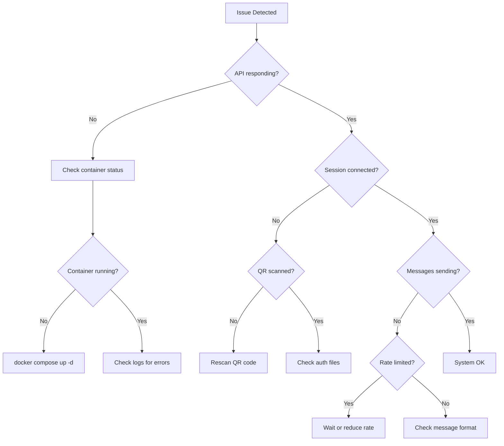
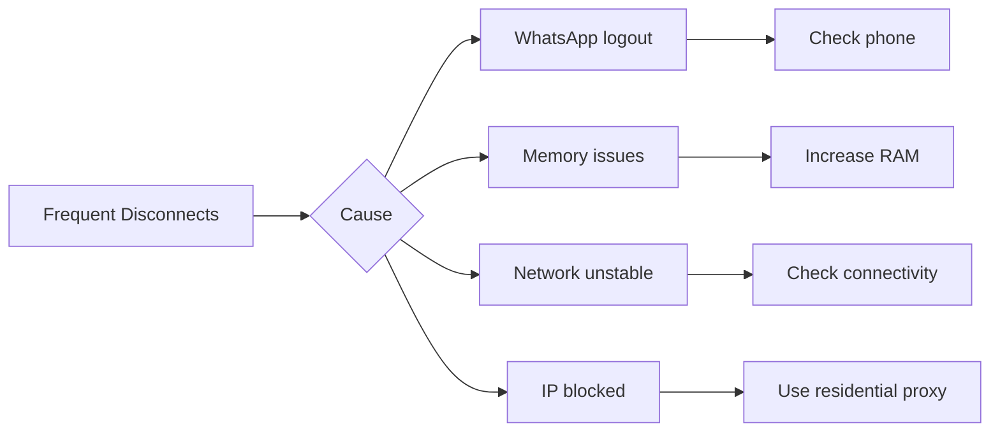
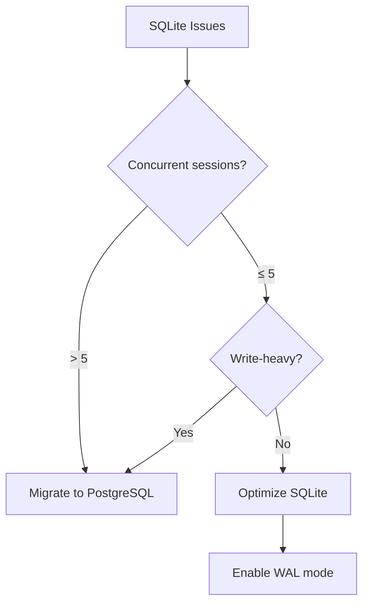

# 12 - Troubleshooting & FAQ

## 12.1 Quick Diagnostics

### Health Check Commands

```bash
# Basic health check
curl http://localhost:2785/api/health

# Readiness (DB) check
curl -H "X-API-Key: $API_KEY" \
  http://localhost:2785/api/health/ready

# Check specific session
curl -H "X-API-Key: $API_KEY" \
  http://localhost:2785/api/sessions/{sessionId}

# Check all services
docker compose ps
docker compose logs --tail=50

# System resources
docker stats openwa-api
```

### Diagnostic Flowchart



## 12.2 Podman Compatibility

### Issue: `FileNotFoundError` / Docker socket missing

**Symptoms:**

```text
docker.errors.DockerException: Error while fetching server API version:
  ('Connection aborted.', FileNotFoundError(2, 'No such file or directory'))
```

**Cause:** The system uses Podman (not Docker Engine). Podman's rootless socket is inactive by default.

**Fix:**

```bash
systemctl --user start podman.socket
systemctl --user enable podman.socket
export DOCKER_HOST=unix:///run/user/$(id -u)/podman/podman.sock
```

Add the `export` to `~/.bashrc` to make it permanent.

---

### Issue: `short-name did not resolve to an alias`

**Symptoms:**

```text
Error: creating build container: short-name "nginx:alpine" did not resolve to an alias
and no unqualified-search registries are defined
```

**Cause:** Podman rootless mode does not fall back to Docker Hub for unqualified image names.

**Fix:** All `FROM` directives in the `Dockerfile` must use fully-qualified names:

```dockerfile
FROM docker.io/node:22-slim
```

---

### Issue: Healthcheck always `unhealthy` on Node 22 + Podman

**Symptoms:** Container starts successfully but stays `unhealthy`; logs show:

```text
SyntaxError: Unexpected end of input
at evalTypeScript (node:internal/process/execution:256:22)
```

**Cause:** Node 22 routes `node -e` through its TypeScript evaluator which rejects arrow-function
syntax. Podman also splits quoted shell commands on whitespace, truncating the `-e` argument.

**Fix:** Use `curl` for the healthcheck instead of `node -e`. The shipped image, `docker-compose.yml`
and `docker-compose.dev.yml` already do; this applies to a healthcheck you wrote yourself:

```dockerfile
HEALTHCHECK --interval=30s --timeout=10s --start-period=30s --retries=3 \
    CMD curl -f http://localhost:2785/api/health/ready || exit 1
```

```yaml
# docker-compose healthcheck
healthcheck:
  test: ['CMD', 'curl', '-f', 'http://localhost:2785/api/health/ready']
```

Ensure `curl` is installed in the production stage:

```dockerfile
RUN apt-get install -y ... curl ...
```

---

## 12.3 Connection Issues

### Issue: Container Won't Start

**Symptoms:**

- `docker compose up` fails
- Container exits immediately
- "Port already in use" error

**Solutions:**

```bash
# Check what's using the port
lsof -i :2785
# or
netstat -tlnp | grep 2785

# Kill process using port
kill -9 $(lsof -t -i:2785)

# Check Docker logs (service name in the shipped production compose; it is `openwa` in
# docker-compose.dev.yml)
docker compose logs openwa-api

# Common fixes
docker system prune -f         # Clean up dangling images/containers
git pull                       # The shipped compose BUILDS openwa-api from source —
docker compose up -d --build   # `docker compose pull` never updates it
```

> Do **not** reach for `docker compose down --volumes` here. It deletes the `openwa-data` volume,
> which holds the linked WhatsApp session profiles, the auth/audit database and every API key — a
> port conflict never requires it.

### Issue: Dashboard Renders a Blank White Screen

**Symptoms:**

- The API is healthy (`curl http://<host>:2785/api/health` returns `200`) but the dashboard is blank
- The startup log says `Dashboard: serving bundled UI at …` — the UI _is_ being served
- The browser console shows script-loading errors; DevTools → Network shows the `/assets/*.js`
  requests going to `https://` even though you opened the page over `http://`
- You reach the instance directly over plain HTTP (a host:port allocation, a private network, a
  panel like Pterodactyl) rather than through a TLS-terminating reverse proxy

**Cause:** In production OpenWA sends the CSP `upgrade-insecure-requests` directive, which tells the
browser to upgrade every sub-resource fetch to HTTPS. That is correct behind a TLS proxy. Over plain
HTTP the browser upgrades the dashboard's own script requests to `https://`, the non-TLS server
cannot answer them, no JavaScript runs, and React never mounts — a blank page. The failure happens
in the browser, so the server log stays clean.

**Solution:**

```bash
# Opt out, then fully restart the container (not just reload)
CSP_UPGRADE_INSECURE_REQUESTS=false

# Confirm it actually reached the process
docker compose exec openwa-api printenv NODE_ENV CSP_UPGRADE_INSECURE_REQUESTS
```

A production boot that serves the dashboard with the opt-out unset prints a warning naming this
setting. If you are behind a TLS proxy, ignore that warning — the directive is doing its job.

> The alternative is to front OpenWA with your own TLS-terminating reverse proxy (the shipped
> `docker-compose.yml` has none; see the nginx example in 12.8), which serves the dashboard over
> HTTPS and makes the upgrade a no-op.

### Issue: Session Won't Connect

**Symptoms:**

- QR code generated but session stays `initializing`
- Session ends in `failed` (with a `lastError`) after scanning the QR
- Session stuck at `qr_ready` or `authenticating` and never reaches `ready`

**Diagnostic:**

```bash
# Check session status
curl -H "X-API-Key: $API_KEY" \
  http://localhost:2785/api/sessions/{sessionId}

# Check WhatsApp engine logs
docker compose logs openwa-api 2>&1 | grep -i "whatsapp\|puppeteer\|browser"

# Check auth folder. Both engines key it on the session UUID id, but the location differs:
#   whatsapp-web.js → SESSION_DATA_PATH (default /app/data/sessions), dir `session-<id>`
#   baileys         → BAILEYS_AUTH_DIR  (default /app/data/baileys),  dir `<id>` (no prefix)
docker compose exec openwa-api ls -la /app/data/sessions/session-<id>/   # whatsapp-web.js
docker compose exec openwa-api ls -la /app/data/baileys/<id>/            # baileys
```

**Solutions:**

| Cause                 | Solution                             |
| --------------------- | ------------------------------------ |
| Expired QR            | Generate new QR (valid 60 seconds)   |
| Auth folder corrupted | Delete and rescan                    |
| Browser crash         | Restart container                    |
| Network issues        | Check firewall/proxy                 |
| WhatsApp blocked      | Set a per-session proxy (`proxyUrl`) |

```bash
# Clear auth and restart (the profile dir carries the session's UUID id, not its name).
# Remove the one that matches the session's engine — deleting the other path is a silent no-op.
docker compose exec openwa-api rm -rf /app/data/sessions/session-<id>   # whatsapp-web.js
docker compose exec openwa-api rm -rf /app/data/baileys/<id>            # baileys
docker compose restart openwa-api
```

> The service name above is the one in the shipped production `docker-compose.yml` (`openwa-api`),
> which mounts `/app/data` from a **named volume** — there is no `./data` on the host to inspect;
> reach into the container (`docker compose exec openwa-api ls /app/data/sessions`) instead. In
> `docker-compose.dev.yml` the app service is called `openwa` and `./data` is bind-mounted, so the
> same paths can be read directly from the host. Host-relative `./data/...` commands elsewhere in
> this document assume a source install (`npm run start:dev`) or that dev bind mount.

Proxy egress (if WhatsApp is blocked on your network) is configured **per session** via the
`proxyUrl` field on `POST /api/sessions` or with `PATCH /api/sessions/:sessionId/proxy`, both of
which need an ADMIN key. It is **not** an environment variable, and an unreachable proxy silently
blocks the WhatsApp WebSocket on either engine (see the _No QR code appears, or `/start` returns `504`_
entry below: on whatsapp-web.js `/start` returns `504`, on Baileys it succeeds and no QR arrives).

### Issue: Linking asks for a passkey and never completes (both engines)

**Symptoms:**

- The phone shows "Create a passkey to log in" or "Continue on your other device" during linking, by QR or by pairing code
- The session stays `qr_ready` on both engines; on Baileys the log shows `408` or `428` close loops, and a pairing code never appears
- On whatsapp-web.js the page shows a "Quick security check with Passkey" modal that never succeeds

**Cause:** WhatsApp added a passkey (WebAuthn) step to its companion linking handshake for some
accounts. That step is enforced server-side inside the linking frames, which live in the engine
libraries; neither whatsapp-web.js 1.34.7 nor Baileys 7.0.0-rc14 implements it, and OpenWA passes the
QR string and the pairing-code request straight through to those libraries. There is no OpenWA-side
fix, and nothing on the client side changes the outcome: switching engine, using a pairing code instead
of a QR, or presenting a different client identity (`BAILEYS_BROWSER_NAME` or otherwise) all end at the
same gate. Re-registering the number as a different account type has also been tried by the community
and did not hold; the block returned on its own within days. Tracked in
[#560](https://github.com/rmyndharis/OpenWA/issues/560) and upstream in
[WhiskeySockets/Baileys#2672](https://github.com/WhiskeySockets/Baileys/issues/2672); the only durable
change will come from the engine libraries implementing the step.

### Issue: Phone-number pairing fails with "Couldn't link device" (Baileys)

**Symptoms:**

- `POST /api/sessions/:sessionId/pairing-code` returns a code, but the phone answers "Couldn't link device" after it is entered
- The engine log then shows a `401` close with `Session disconnected: logged out`, the auth directory is cleared, and the session comes back at `qr_ready` with no phone
- Linking the same account by QR works

**Cause:** the pairing request carries the linked-device identity, and some accounts reject a
non-standard one. The default device name is `OpenWA`; set `BAILEYS_BROWSER_NAME=Ubuntu` (or another
standard OS name), restart OpenWA itself (the name is read at boot, so stopping and starting the session
is not enough), and request a fresh code. The name applies to new pairings only;
a session that is already linked keeps the name it was paired with until it is re-linked. See the
phone-number pairing example in `docs/examples/session-phone-number-pairing.md`.

### Issue: No QR code appears, or `POST /api/sessions/:sessionId/start` returns `504`

**Symptoms:**

- On whatsapp-web.js, `POST /api/sessions/:sessionId/start` returns `504 Gateway Timeout`
  (`WhatsApp Web authentication timed out...`)
- On Baileys, `POST /api/sessions/:sessionId/start` succeeds and the session keeps retrying the connection
- No QR code is ever produced — `GET /api/sessions/:sessionId/qr` never has one
- On whatsapp-web.js, the engine log shows `Session engine failed: auth timeout` after ~30s

**Cause:** The session was created with a `proxyUrl` that doesn't resolve to a real, reachable proxy
(e.g. the `http://proxy.example.com:8080` placeholder copied from an example). The engine sends its
WhatsApp WebSocket through that proxy, so it can never connect and no QR is produced. On
whatsapp-web.js, which launches Chromium pinned to the proxy, the auth poll then times out; Baileys
keeps retrying the connection instead.

**Fix:** Don't set a proxy unless your network actually requires one. Clear `proxyUrl` in place, or
set it to a real, reachable proxy server the same way, with an ADMIN key. The change applies on the
next start, so stop and start the session afterwards:

```bash
# No proxy needed (the common case):
curl -X PATCH "$BASE/api/sessions/{sessionId}/proxy" -H "X-API-Key: $ADMIN_API_KEY" \
  -H "Content-Type: application/json" -d '{ "proxyUrl": null }'
curl -X POST "$BASE/api/sessions/{sessionId}/stop" -H "X-API-Key: $API_KEY"
curl -X POST "$BASE/api/sessions/{sessionId}/start" -H "X-API-Key: $API_KEY"
```

> ℹ️ Proxy egress, on either engine, is configured **per session** via the
> `proxyUrl` field on `POST /api/sessions` or `PATCH /api/sessions/:sessionId/proxy` (ADMIN key for
> both), not via environment variables.

> ℹ️ A `504` whose body starts with `Engine initialization timed out after ...` is a **different**
> failure with a different fix: initialization never finished at all. That happens when WhatsApp Web,
> the network or the session proxy is unreachable in a way that hangs the connection instead of
> failing it, and when the browser stalls during startup (typically a container memory or resource
> limit). Check egress to `web.whatsapp.com`, the session's `proxyUrl` and the container's memory
> limit. The auth poll that produces the message above only starts once the page has loaded, so it
> never fires for a connection that hangs before that.

### Issue: Session stuck at `authenticating`, never reaches `ready`

> **Engine:** This stall applies to the `whatsapp-web.js` engine only. Baileys also reports `authenticating`, but only for the seconds between WhatsApp accepting the link and the restart it requests; it cannot park there, so if you are using `ENGINE_TYPE=baileys`, skip this section.

**Symptoms:** After scanning the QR the phone links the device, but the session stays at
`authenticating` indefinitely and never becomes `ready`. `GET /sessions/:sessionId/qr` returns 400 while
stuck. Often seen on ARM64 (e.g. Raspberry Pi) after upgrading to v0.2.x.

**Cause:** whatsapp-web.js auto-selects a WhatsApp Web client version, and an incompatible version
stalls the post-link sync. (If you also see `chrome_crashpad_handler: --database is required` _and the
session never starts at all_, that is a different problem — see "Session fails to launch …" below.)

**Fix:** OpenWA reconciles a missed `ready` event when WhatsApp Web is connected, the injected
runtime is available, and whatsapp-web.js has populated the linked account identity. If your
environment still hits a WA-Web compatibility hang, pin a known-good WA-Web version with
`WWEBJS_WEB_VERSION`:

```bash
# Optional workaround — substitute a build that the registry currently serves:
WWEBJS_WEB_VERSION=<a build from that registry's html/ folder>
```

Restart the container after changing it. Pick the build from
[wppconnect-team/wa-version](https://github.com/wppconnect-team/wa-version) (the `html/` folder) — a
build the registry no longer serves cannot be fetched, and the session starts on the live build rather
than the pin you asked for, with a warning at start (action `web_version_html_unavailable`, naming the
build, the URL and the reason). With
`WWEBJS_WEB_VERSION` unset, `latest`, or `auto` (the default), OpenWA auto-resolves a settled build
from that registry and pins its HTML — note this HTML is fetched from a third-party repository and
executed inside the `web.whatsapp.com` origin without an integrity check. Set
`WWEBJS_WEB_VERSION=off` to disable pinning and use the first-party build served by WhatsApp. An
unpinned session (this setting, or an auto-resolve that could not reach the registry) caches nothing to
disk, so it also works on the image's read-only root filesystem. A pinned build's HTML is downloaded
at start, with a 10 s bound, into `<SESSION_DATA_PATH>/.wa-web-cache/` on the writable data volume and
served from there; a build no session has started on for a week is removed.

A pin is not guaranteed to hold. whatsapp-web.js applies it by answering the page's document request
with the pinned HTML, and that can miss in two ways: a pin whose HTML could not be fetched is dropped
at start (the `web_version_html_unavailable` warning above) and the live build loads, and WhatsApp
Web's service worker can serve its own cached build without the request reaching whatsapp-web.js. In
the second case the page runs a different build than the one requested, while the startup line
`Pinning WhatsApp Web version …` still names the requested build.
When a session reaches `ready`, OpenWA reads the build the page reports and logs it (action
`web_version_running`); when a pin was requested and the page runs a different build, it logs a
warning naming both (action `web_version_pin_not_applied`). The comparison ignores the registry's
suffix such as `-alpha`, so a pin and the same bare build count as a match.

The warning changes nothing about the session. It reached `ready` on the build the warning names, so
the pin did not cover that page load, and a session that works on that build needs no action.
Whether the service worker answers can differ from one page load to the next, so a later restart may
load the pin. When you report a problem with the session, include both builds.

If the session is still `authenticating` 90 s after the link, OpenWA stops waiting. If WhatsApp Web
reports the session connected but its event bridge never attached, the session is marked `failed` with
the credentials kept (action `ready_reconcile_bridge_dead`), whether it was linked in that start or
restored: restart it to relaunch the browser. Otherwise, a session linked by a QR or pairing code in
that start has its saved credentials cleared once and comes back with a fresh QR. A session restored
from saved credentials is marked `failed` with the credentials kept (action
`ready_reconcile_timeout_restored`): restart it; to pair again, delete it (which clears the saved
credentials) and create it anew; or pin `WWEBJS_WEB_VERSION`.

### Issue: QR generation times out on slow first boot (WSL2 / low-resource)

> **Engine:** This issue applies to the `whatsapp-web.js` engine only. If you are using `ENGINE_TYPE=baileys`, skip this section.

**Symptoms:** On the first launch the session never produces a QR code and fails after ~30 seconds,
often inside WSL2 or a resource-constrained container while WhatsApp Web is still loading.

**Cause:** whatsapp-web.js waits a fixed 30000ms for WhatsApp Web to finish its initial load before
generating the QR. On a slow first boot that window can expire before the page is ready.

**Fix:** raise the boot/inject wait (milliseconds) with `WWEBJS_AUTH_TIMEOUT_MS`:

```bash
# Allow up to 2 minutes for the first-boot init wait:
WWEBJS_AUTH_TIMEOUT_MS=120000
```

Restart the container after setting it. Leave it unset to keep the default (30000ms).

### Issue: Session fails to launch with `chrome_crashpad_handler: --database is required`

> **Engine:** This issue applies to the `whatsapp-web.js` engine only (Chromium/Puppeteer-based). It does not affect `ENGINE_TYPE=baileys`.

**Symptoms:** The session never starts; the engine log shows `Failed to launch the browser process` with
`chrome_crashpad_handler: --database is required`, and the host kernel log shows a Chromium
`trap int3` / `Trace/breakpoint trap (core dumped)`. Seen on hardened, `read_only` containers.

**Cause:** Chromium resolves its home directory from the passwd entry (glibc `getpwuid()`) and **ignores
`$HOME`**. The non-root `openwa` user has no home dir, so Chromium tries to use `/home/openwa`, which does
not exist on the read-only rootfs — and aborts at launch. (Setting `HOME=` does **not** help, and
`--crash-dumps-dir` is a no-op for the crashpad database on Debian/Ubuntu system Chromium.)

**Fix:** Give Chromium writable, pre-created config/cache dirs via `XDG_CONFIG_HOME` / `XDG_CACHE_HOME`.
The bundled image and `docker-compose.yml` already do this (the entrypoint creates them on the tmpfs `/tmp`,
owned by `openwa`). If you run a custom container, ensure both are set to a writable, existing path:

```bash
XDG_CONFIG_HOME=/tmp/.config
XDG_CACHE_HOME=/tmp/.cache
# and create them owned by the runtime user before launch:
#   mkdir -p /tmp/.config /tmp/.cache && chown <user> /tmp/.config /tmp/.cache
```

On a `read_only` rootfs you **must** also mount a writable tmpfs/emptyDir at `/tmp` (compose:
`tmpfs: [/tmp]`; k8s: an `emptyDir` at `/tmp`) — otherwise the entrypoint cannot create these dirs and
will exit at startup with a clear `FATAL:` message rather than crash-looping later.

Do **not** work around this by dropping `--no-sandbox` security hardening or using `seccomp:unconfined`
(confirmed not to help, and it widens the attack surface).

### Issue: Session fails to launch with `Failed to launch the browser process: Code: null`

> **Engine:** This issue applies to the `whatsapp-web.js` engine only (Chromium/Puppeteer-based). It does not affect `ENGINE_TYPE=baileys`.

**Symptoms:** The session fails within a few seconds of clicking **Start**; no QR code is ever produced. The
session's `lastError` and the container log both show:

```text
Failed to launch the browser process:  Code: null
```

often accompanied by a wall of `ERROR:dbus/bus.cc` / `crashpad ... /sys/devices/system/cpu/...` lines.
**Those dbus/crashpad lines are non-fatal noise** that headless Chromium always prints inside a container —
ignore them. The actual signal is `Code: null`, which means the browser process was killed during startup
before it could report an exit code. The cause is _not_ in the log — it's a host/container resource limit,
and there are three distinct ones. Diagnose which one before changing anything:

**Cause A — per-container PID limit hit (most common under multi-session).**
whatsapp-web.js runs a full Chromium instance per session, and Chromium is multi-process (browser + renderer

- GPU + zygote + utilities); WhatsApp Web is itself process-heavy (service workers, iframes). A handful of
  concurrent sessions can approach the container's `pids_limit`, and the next session's Chromium gets killed
  mid-spawn when a `fork()` returns `EAGAIN`. This is silent in the log.

_Diagnose:_ watch the PIDS column while you click **Start**:

```bash
docker stats openwa-api   # watch the PIDS column — does it climb toward the limit right before the failure?
```

_Fix:_ raise the ceiling. The bundled `docker-compose.yml` exposes it as `OPENWA_PIDS_LIMIT` (default `2048`,
which fits ~8-10 sessions with startup-spike headroom):

```bash
OPENWA_PIDS_LIMIT=4096   # in your .env, then docker compose up -d
```

Do **not** set `-1` (unlimited) — the PID ceiling is a fork-bomb guard and should stay finite. Baileys
(no Chromium) uses only a handful of PIDs regardless, so raising this is a no-op there.

**Cause B — out-of-memory kill.**
The container's `mem_limit` (or the host VM, e.g. Docker Desktop on macOS/Windows) ran out of RAM while
Chromium was starting. The OOM killer sends `SIGKILL`, which Puppeteer reports as `Code: null`.

_Diagnose:_ check the host kernel log for an OOM kill:

```bash
dmesg -T | grep -i "killed process"          # Linux host
# Docker Desktop: check the VM via the app, or nudge OPENWA_MEM_LIMIT up and retry
```

_Fix:_ raise the ceiling (`OPENWA_MEM_LIMIT=4g` in your `.env`, or Docker Desktop → Settings → Resources →
Memory for the VM).

**Cause C — the XDG/crashpad home-dir crash.**
If `Code: null` is accompanied by `chrome_crashpad_handler: --database is required`, that is a different,
specific failure (Chromium can't resolve its home directory on a read-only rootfs) — see the entry
immediately above this one for the fix. The bundled image already handles this; it only resurfaces on a
custom container that drops the `XDG_CONFIG_HOME` / `XDG_CACHE_HOME` setup or the writable `/tmp` tmpfs.

**Cause D — Debian 12 OS Chromium SIGTRAP in non-root Pods.**
If `Code: null` happens on Kubernetes, and the host kernel logs or `dmesg` shows `Trace/breakpoint trap (core dumped)` with exit code 133, the underlying Debian 12 OS `chromium` package has crashed due to strict non-root or seccomp constraints (even with `--no-zygote` or `Unconfined` seccomp).
_Fix:_ On amd64, do not use the `chromium` package from Debian's `apt` — it SIGTRAPs under strict non-root/seccomp. Instead, download Chrome for Testing via Puppeteer during the Docker build (`./node_modules/.bin/puppeteer browsers install 'chrome@153.0.8010.36'`) and point `PUPPETEER_EXECUTABLE_PATH` to it. (arm64 keeps Debian's `chromium`, which ships a native arm64 binary, by choice: Chrome for Testing publishes linux-arm64 builds only from 153, and the image has not moved arm64 to one.) The official `Dockerfile` implements this mixed approach.

**Quick triage:** run `docker stats openwa-api`, click **Start**, and watch which resource spikes toward its
limit the instant before the failure — that tells you A vs B. If neither moves and you see the crashpad
`--database` line, it's C. If running in K8s as non-root with the Debian `chromium` package, it is likely D.

### Issue: `Execution context was destroyed` on the first start after an upgrade

> **Engine:** This issue applies to the `whatsapp-web.js` engine only (Chromium/Puppeteer-based). It does not affect `ENGINE_TYPE=baileys`.

**Symptoms:** A `whatsapp-web.js` session that was already authenticated fails within seconds of
**Start** after upgrading OpenWA — no QR is produced — and the session's `lastError` / container log
show:

```text
Protocol error (Runtime.callFunctionOn): Execution context was destroyed.
```

**Cause:** The session's persistent browser profile (`<SESSION_DATA_PATH>/session-<id>`, created by
whatsapp-web.js's `LocalAuth`) was built with a different Chromium/Chrome binary than the one the new
image runs. A browser profile carries binary-bound state (page caches, GPU shader caches, IndexedDB /
Local Storage version markers) that is not safely portable across Chromium major versions or binary
flavours; loading the stale profile destroys the page context during `Client.inject()`. The dominant
trigger today is the **v0.8.12** amd64 switch from Debian's `chromium` package to Chrome for Testing
(#663), but the same symptom can follow any future change to the bundled browser binary. The error
reads like a Puppeteer bug and gives no hint that the profile is the cause — the adapter now logs an
advisory when it detects this error, and the session's `lastError` (the message the dashboard shows on
the session card) carries a short form of it, so the pointer survives without reading the container log.

**Rolling back to an older browser** does not raise this error. An older Chrome silently deletes the
IndexedDB of a profile a newer Chrome has opened, and that is where whatsapp-web.js keeps the WhatsApp
login: every previously linked session starts at a QR code instead of reconnecting, the log names no
cause (0.23.3 and 0.23.4 log only a generic `relink_required` warning), and upgrading again does not bring
the pairing back. On amd64 this follows a rollback from 0.23.5 or later (Chrome for Testing 153) to 0.23.4
or earlier (146); on arm64, a rollback to an image built with an older Debian chromium major. Restoring
`sessions/` from a backup taken before the first start on the newer image keeps the pairing (see the
upgrade runbook's rollback in docs/11); without one, scan a new QR.

**Fix:** delete the affected session's profile dir and start the session again to scan a new QR. The
profile cannot be salvaged — clearing only the cache subdirs (`Cache`, `GPUCache`, `Code Cache`, …) is
**not** enough, the taint is deeper than the caches — so a one-time re-authentication is required.

The profile dir is named after the session **id** (the UUID the REST API addresses it by), so
`GET /api/sessions` gives you the value for both commands below:

```bash
docker exec openwa-api rm -rf /app/data/sessions/session-<id>
# then POST /sessions/<id>/force-kill and POST /sessions/<id>/start, and scan the new QR
```

Re-creating the session (`DELETE /sessions/<id>`) also purges its profile dir; create it again and
scan. Messages are unaffected — they live in the database, not the browser profile — so nothing is lost
except the WhatsApp pairing, which must be re-scanned.

`force-kill` requires a started session — it returns `400` when no live engine is registered (there
is nothing to SIGKILL). A browser left wedged by an earlier teardown is reaped automatically by the
next `start()` (an orphan sweep keyed on the session's browser marker runs at every engine launch),
so the stop → start sequence alone is sufficient once the engine is gone.

### Issue: Freshly paired session logs out at the first five-minute reload

> **Engine:** This issue applies to the `whatsapp-web.js` engine only.

**Symptoms:** The session reaches `ready` normally, then at almost exactly five minutes WhatsApp Web
reloads, briefly returns to `CONNECTED`/`hasSynced`, and navigates to
`?post_logout=1&logout_reason=0`. The phone silently removes the companion from Linked devices and
OpenWA returns to a fresh QR because `whatsapp-web.js` deletes LocalAuth credentials on `LOGOUT`.

**Cause:** OpenWA used to backfill active WhatsApp Status posts immediately in its `ready` callback by
fetching `status@broadcast`. Some accounts tolerate that request, but affected accounts have the new
companion revoked at WhatsApp Web's first scheduled reload. A minimal `whatsapp-web.js` client using
the same container, browser, account and Web build remains linked when it does not perform this eager
fetch.

**Fix:** Status backfill-on-ready is disabled by default. Keep `STATUS_SEED_ON_READY=false` for
affected accounts. Live status events still work; only the one-time history backfill of statuses that
predate the connection is skipped. Operators who have tested their accounts and need the backfill can
opt in with `STATUS_SEED_ON_READY=true`.

### Issue: Session stuck at `action_required` ("What's new" onboarding modal)

> **Engine:** This issue applies to the `whatsapp-web.js` engine only (Chromium/Puppeteer-based). It does not affect `ENGINE_TYPE=baileys`.

**Symptoms:** A freshly linked session leaves `ready` for `action_required` within its first minutes,
every send returns `409` ("session not connected"), and the session's `lastError` says WhatsApp keeps
showing its onboarding modal after repeated attempts to dismiss it.

**Cause:** New WhatsApp accounts are shown a "What's new" modal after linking that must be
acknowledged before the companion device is allowed to stay linked. The adapter auto-dismisses it
and only gives up after five clicks that fail to land — at that point a human must click through it
once, so the session stops instead of being silently unlinked by WhatsApp about five minutes later.

> **If the modal is not in English:** by default the detector matches only the English button label
> (`Continue`) under the English heading ("What's new"). OpenWA appends `--lang=en-US` to the browser
> flags unless `PUPPETEER_ARGS` already carries a `--lang`, but that sets the browser's language, and
> WhatsApp Web may still render in the account's own language. For another language, add the modal's
> confirm-button label to `WWEBJS_ONBOARDING_CONTINUE_LABELS` (for example `Continuar`) and restart
> OpenWA itself: the value is read at boot, so stopping and starting the session is not enough. A
> configured label is clicked
> without the English heading check, but only on a button inside a visible dialog. If your deployment gets a
> localised modal without a matching label, it is **not** auto-dismissed and the session never reaches
> `action_required`; instead it links normally, then drops to `disconnected` with reason `LOGOUT` a few
> minutes later and the device disappears from the phone's Linked devices list. That miss is not
> silent: when the watcher finds a visible dialog it cannot match, it logs a warning
> (`action: onboarding_dialog_unrecognized`) carrying the dialog's heading and button labels, including
> the label to add, minutes before the unlink would happen. Copy that label as printed: a multi-word
> label works, and whitespace runs compare as one space. Because that path wipes the stored
> credentials, the automatic reconnect comes back with a fresh QR on its own, so the session is
> usually already sitting at `qr_ready` rather than needing a manual start. Acknowledge the modal once
> in a browser signed in as that account, then scan the QR. It does not recur — the modal is shown
> once per account.

> **While a session sits in `action_required`** the liveness watchdog keeps probing it, but only to
> report: a failed probe is logged (`action: watchdog_probe_failed_observe_only`, once per
> unresponsive stretch) and never reconnects the session or changes its status. So a page that died
> while waiting for you is visible in the logs, and the status still means what it says. If you see
> that warning, the page is gone and the stop → start below is required rather than optional.

**Fix:** acknowledge the modal once (open WhatsApp Web in the account holder's own browser and click
through the "What's new" screen), **then restart the session** (`POST /sessions/:sessionId/stop` →
`POST /sessions/:sessionId/start`). Acknowledging alone does not return the session to `ready` — the status
is deliberately sticky — but the restart re-drives the engine from the stored credentials, so no new
QR scan is needed. If the modal never actually appeared (a false trip is possible but rare), the
same stop → start clears it.

### Issue: Frequent Disconnections

**Symptoms:**

- Session disconnects every few hours
- `disconnected` status in logs
- Need to rescan QR frequently

**Causes & Solutions:**



**Configuration fixes:**

The reconnect backoff is configured **per session**, not by environment variables — pass it in the
`config` object on `POST /api/sessions`:

```json
{
  "name": "my-bot",
  "config": {
    "reconnectBaseDelay": 5000,
    "maxReconnectAttempts": 10
  }
}
```

`reconnectBaseDelay` is the exponential-backoff base in milliseconds (1000–300000, default 5000).
`maxReconnectAttempts` accepts 0–20 (a value outside the range is refused with a 400) — `0` disables
auto-reconnect entirely, and leaving it unset means unlimited retries with the delay parking at a
5-minute cap. Both keys bound the gateway's own reconnect, whose attempt count restarts only once
the session has stayed READY for 5 minutes, so a session that keeps dropping sooner than that spends
a finite cap and ends FAILED. On Baileys that is only the reconnect after a logged-out close: every
other drop is retried inside the engine, with a fixed 1s to 60s backoff and no attempt cap, so a
session behind an unreachable network keeps retrying there whatever these keys say. Subscribe to the
`session.reconnect_loop` webhook to be alerted on every 5th consecutive attempt.

On a slow host, raise the first-boot init wait with `WWEBJS_AUTH_TIMEOUT_MS` (see _QR generation
times out on slow first boot_ above).

## 12.4 Messaging Issues

### Issue: Messages Not Sending

**Symptoms:**

- API returns 200 but message not delivered
- "Message send failed" errors
- Messages stuck in queue

**Diagnostic:**

```bash
# Check message history
curl -H "X-API-Key: $API_KEY" \
  http://localhost:2785/api/sessions/{sessionId}/messages/{chatId}/history

# Check queue / infra status (ADMIN)
curl -H "X-API-Key: $API_KEY" \
  http://localhost:2785/api/infra/status

# Rate limiting is env-configured, per route and client IP; there is no per-session rate-limit endpoint
```

**Common Causes:**

| Cause                            | Symptom                                                         | Solution                                                                          |
| -------------------------------- | --------------------------------------------------------------- | --------------------------------------------------------------------------------- |
| Invalid phone number             | 400 error                                                       | Format: `628123456789@c.us`                                                       |
| Rate limited                     | 429 error                                                       | Reduce sending rate                                                               |
| Session not started or not ready | 400 (`is not active`) or 409                                    | Start or reconnect the session                                                    |
| Media too large                  | 413 error                                                       | Compress or reduce size                                                           |
| Number not on WhatsApp           | 400 on whatsapp-web.js; Baileys may accept it and never deliver | Verify the number first (`GET /api/sessions/{sessionId}/contacts/check/{number}`) |

**Phone Number Validation:**

```typescript
// Correct format
const validFormats = [
  '628123456789@c.us', // Indonesian
  '14155552671@c.us', // US
  '628123456789-1234@g.us', // Group ID
];
```

```bash
# Check whether a number is on WhatsApp (needs an OPERATOR key; {sessionId} is the id from GET /api/sessions)
curl -H "X-API-Key: $API_KEY" \
  "http://localhost:2785/api/sessions/{sessionId}/contacts/check/628123456789"
```

### Issue: Sends return 500 "engine returned no message", and chats or media fail with `r: r`

**Symptoms:**

- `POST /api/sessions/{id}/messages/send-text` returns `{"statusCode":500,"message":"Internal server error"}` — but the message _is_ delivered
- Logs show `the engine returned no message for this send, so it may not have been delivered`
- Unrelated operations fail with the minified error `r: r`: `GET /api/sessions/{id}/chats`, media downloads, typing indicators
- Startup logs may contain `The installed whatsapp-web.js is missing the message-id backport…`

**Cause:** WhatsApp Web 2.3000.x renamed the internal message-id property that whatsapp-web.js
reads. OpenWA ships a backport that restores it, applied at install time by
`scripts/patch-wwebjs-201832.js`. When the install cannot run it — neither GNU `patch` nor `git`
available, or `npm install --ignore-scripts` — whatsapp-web.js stays unpatched and every operation
that reads a message id fails. Source installs only; the Docker image always applies the backport.

**Solution:**

```bash
# Is the backport missing? Works on every platform, including Windows without grep.
node -e "console.log(require('fs').readFileSync('node_modules/whatsapp-web.js/src/structures/Base.js','utf8').includes('_normalizeId')?'PATCHED':'NOT PATCHED')"

# Apply it, then restart
node scripts/patch-wwebjs-201832.js
```

If that reports a partially patched tree, reinstall the dependency first:

```bash
rm -rf node_modules/whatsapp-web.js && npm ci
```

> Pinning `WWEBJS_WEB_VERSION` does **not** work around this — the rename is present in every
> current WhatsApp Web build, so no pin avoids it.

### Issue: Startup logs say install-time patches are missing

**Symptoms:**

- Startup logs contain `The installed whatsapp-web.js is missing N of OpenWA's install-time patches: …`,
  or the same line naming `@whiskeysockets/baileys`
- One capability fails while everything around it works: an unnamed `500` from a single route,
  block/unblock refusing every id, a status media send that never arrives, a group description that
  cannot be set, an app-state resync that never settles

**Cause:** OpenWA applies twelve exact source transforms to its engine libraries at install time
(docs/29 §29.3). The Docker image runs them without `--best-effort`, so a source shape a patcher
cannot recognise fails the image build. A source install runs them through `scripts/postinstall.js`
with `--best-effort`, where a patcher that cannot apply prints one line into a long `npm install`
transcript and the install still succeeds. The usual causes are `npm install --ignore-scripts` and
an upstream release whose shape a patcher no longer recognises. Each engine now checks its own
patches as it starts and names the ones that did not land, so the report arrives on the machine that
is actually affected rather than in an install log nobody kept.

**Solution:**

```bash
# Which patches are missing? Works on every platform, including Windows without grep.
node -e "const fs=require('fs'),p=require('path');for(const f of fs.readdirSync('scripts').filter(n=>n.startsWith('patch-')&&n.endsWith('.js')&&!n.endsWith('.spec.js')).sort()){const m=require('./scripts/'+f);if(typeof m.isApplied!=='function')continue;const k=f.startsWith('patch-wwebjs-')?'whatsapp-web.js':'@whiskeysockets/baileys';try{console.log((m.isApplied(p.dirname(require.resolve(k+'/package.json')))?'APPLIED    ':'NOT APPLIED')+' '+f)}catch{}}"

# Apply each one it named, then restart
node scripts/patch-wwebjs-group-description.js
```

If a patcher answers with an unsupported-shape error instead of applying, the installed library has
moved and the transform needs re-evaluating against it. Reinstalling will not help; open an issue
quoting the message it printed.

> `patch-wwebjs-201832.js` is not in that list. It carries its own startup check and its own entry
> above, because a partially applied backport needs different advice than one that never ran.

> A patch that never applied is not fatal on its own: only the capability it repairs is affected and
> the rest of the gateway runs normally, which is why this is easy to misread as a bug in one route.

### Issue: Reads on a large account fail with `did not answer ... in time` or `Runtime.callFunctionOn timed out`

> **Engine:** This issue applies to the `whatsapp-web.js` engine only (Chromium/Puppeteer-based). It does not affect `ENGINE_TYPE=baileys`.

**Symptoms:**

- `GET /api/sessions/{id}/chats`, `GET /api/sessions/{id}/groups` (or another read that walks the
  whole store) fails on an account with thousands of chats, while smaller accounts on the same deployment are fine
- The chat, group and contact lists answer `503` with `WhatsApp Web did not answer the chat list read in time`
  (or `the contact list read`); another read may answer `500` with the raw error, which names a CDP
  method and the setting: `Runtime.callFunctionOn timed out. Increase the 'protocolTimeout' setting in launch/connect calls for a higher timeout if needed.`
- The session stays `ready` and the next request works, so the page did not die

**Cause:** Puppeteer gives every browser command a time budget, 180 000 ms by default, and one
read of the whole chat list over a very large store can run past it. The renderer is still working; only the
command is dropped. That is also why this is **not** treated as a dead page — a transport death
takes the session down with it, while this is just a slow command on a live page. The chat, group and
contact lists answer it with a `503` as well, but the session stays `ready`.

**Solution:** raise the budget for that deployment.

```bash
# 5 minutes, in .env or the environment. Unset means Puppeteer's own 180000.
PUPPETEER_PROTOCOL_TIMEOUT_MS=300000
```

Raise it by as little as the account needs. The budget bounds a command that is slow but still
running; it is not what protects you from a **wedged** browser. A page that stops answering is
caught by the liveness watchdog, which probes every 60 s with a 15 s timeout and treats two
consecutive failures as a disconnect, so a wedge is picked up in roughly 75 to 135 s whatever this
value is. There is no measurement in this repo saying how large an account has to be before 180000
is too small, so treat any value above it as an escape hatch you reached for after seeing the error
above, not as a default worth pre-emptively setting.

> Do not set it to `0`, and do not reach for a row of nines. The gateway refuses to boot on either.
> Puppeteer only arms its timer for a truthy value, so `0` drops the bound altogether and a wedged
> renderer will hold the command, and the request waiting on it, forever — a hung request is worse
> than a failed one. Above `2147483647` Node's timer overflows, warns `TimeoutOverflowWarning`, and
> fires after 1 ms instead, so every command in the launch handshake fails with this same error and
> the browser never starts.

### Issue: Media Upload Fails

**Symptoms:**

- "File too large" error
- "Unsupported media type" error
- Upload timeout

**Solutions:**

```bash
# Media size cap — covers remote-URL sends, inbound media, and outbound base64 sends.
# Default 50 MiB; oversized base64 is rejected with 413 (Payload Too Large).
MEDIA_DOWNLOAD_MAX_BYTES=52428800

# Max request body — base64 media rides inside the JSON body, so raise this too.
# Default 25mb.
BODY_SIZE_LIMIT=25mb

# Note: send the body uncompressed. A request carrying Content-Encoding: gzip (or deflate/br)
# is refused with 415 — the aggregate in-flight cap counts bytes on the wire, so a compressed
# body would be admitted small and then inflated past the memory that cap exists to bound.

# Note: one active API key may hold at most half the aggregate in-flight budget, wherever its
# requests come from, and is refused with 503 + Retry-After past that even while the gateway as a
# whole has room. A single declared body larger than that share gets 413 instead, since a retry
# cannot help. Requests without a recognised key (ingress deliveries included) share a pool of a
# quarter of the budget or twice BODY_SIZE_LIMIT, whichever is larger, and each client IP gets at
# most half of that pool (never less than one full-size body). Behind a reverse proxy, set
# TRUSTED_PROXIES: without it every unkeyed caller resolves to the proxy's own address and shares
# a single IP's share of that pool.

# Supported formats
# Images: jpg, jpeg, png, gif, webp
# Videos: mp4, 3gp
# Audio: mp3, ogg, wav, opus
# Documents: pdf, doc, docx, xls, xlsx, ppt, pptx
```

**Media Compression:**

```bash
# Send an image (by URL or base64)
curl -X POST http://localhost:2785/api/sessions/{id}/messages/send-image \
  -H "X-API-Key: $API_KEY" \
  -H "Content-Type: application/json" \
  -d '{
    "chatId": "628123456789@c.us",
    "url": "https://example.com/image.jpg"
  }'
```

### Issue: Webhook Not Receiving Messages

**Symptoms:**

- Messages received but webhook not triggered
- Webhook URL returns errors
- Duplicate webhook calls

**Diagnostic:**

```bash
# Check webhook configuration — `active` must be true, `events` must list the event (or "*"),
# and `filters` must not exclude it. `lastTriggeredAt` stays null until a real 2xx delivery:
# the Test button never sets it, so a green Test proves nothing about real events.
curl -H "X-API-Key: $API_KEY" \
  http://localhost:2785/api/sessions/{sessionId}/webhooks

# Abandoned deliveries, most recent first: those that exhausted every retry, plus those recorded
# with `attempts: 0`: never attempted, or (queue disabled) stopped by shutdown during a retry
# backoff after earlier attempts. Requires an ADMIN key — an OPERATOR key gets
# a 403, which reads like the endpoint does not exist. Rows older than
# WEBHOOK_FAILURE_RETENTION_DAYS (default 90) are pruned.
curl -H "X-API-Key: $ADMIN_API_KEY" \
  "http://localhost:2785/api/webhooks/delivery-failures?sessionId={sessionId}&limit=20"

# Attempts still in flight (not yet exhausted) appear only in the server logs:
docker compose logs openwa-api 2>&1 | grep -i webhook

# Test webhook endpoint
curl -X POST http://your-webhook-url \
  -H "Content-Type: application/json" \
  -d '{"test": true}'
```

**Solutions:**

Read the two lists together before changing anything. A delivery-failure row carrying an HTTP
`lastStatusCode` means the gateway delivered and your receiver rejected it — fix the receiver. An
empty list with `lastTriggeredAt` still null means nothing has ever been delivered and nothing has
permanently failed: the event either never matched this webhook (`active`, `events`, `filters`) or
was never emitted for the session at all.

Webhooks are rows created through the API — there is no webhook config file:

```bash
curl -X POST http://localhost:2785/api/sessions/{sessionId}/webhooks \
  -H "X-API-Key: $API_KEY" \
  -H "Content-Type: application/json" \
  -d '{
    "url": "https://your-server.com/webhook",
    "events": ["message.received", "message.ack", "session.status"],
    "secret": "your-signing-secret",
    "headers": { "Authorization": "Bearer your-token" },
    "retryCount": 3
  }'
```

`retryCount` (0–5, default 3) is per webhook and counts total delivery attempts, including the first, so `1`
retries nothing. The delivery timings are process-wide environment variables:

```bash
WEBHOOK_TIMEOUT=10000      # per-attempt HTTP timeout in ms (default 10000)
WEBHOOK_RETRY_DELAY=5000   # base retry backoff in ms (default 5000)
```

### Issue: An inbound sender arrives as an `@lid` id instead of a phone number

**Symptoms:**

- `message.received` carries `from` (or `author`, in a group) as `162878178984075@lid` rather than `628123456789@c.us`
- The number cannot be matched against your own contact records, and replies have to be addressed by the `@lid` id
- `contact.number` on the payload repeats the lid digits, so it is not the phone number either

**Cause:** WhatsApp identifies some accounts by a privacy id (`@lid`) instead of their phone number,
and the message itself carries no phone number to read. Mapping one back costs a lookup against the
engine, so the gateway does not do it on every message unless you ask for it.

**Solution:**

```bash
# Resolve a single id on demand — works whether or not the flag below is set
curl -H "X-API-Key: $API_KEY" \
  http://localhost:2785/api/sessions/{sessionId}/contacts/{contactId}/phone

# Or have every inbound message carry it: adds `senderPhone` to the message.received webhook
# and the websocket event. Set it in the `.env` next to docker-compose.yml (both compose files
# already forward the variable), then restart the process — an env change is not picked up by a
# session reload.
RESOLVE_LID_TO_PHONE=true
```

`senderPhone` is `null` when the engine cannot map the id — an `@lid` the account has never seen has
no mapping to return. Both engines support the lookup.

## 12.5 Performance Issues

### Issue: High Memory Usage

**Symptoms:**

- Container using > 1GB RAM per session
- OOM (Out of Memory) kills
- Slow response times

**Diagnostic:**

```bash
# Check memory usage
docker stats openwa-api --no-stream

# Check process memory (Prometheus text; read openwa_process_resident_memory_bytes)
curl -H "Authorization: Bearer $METRICS_TOKEN" \
  http://localhost:2785/api/metrics

# Expected: ~300-500MB per session (whatsapp-web.js / Chromium engine)
# With ENGINE_TYPE=baileys the footprint is significantly lower (no Chromium)
```

**Solutions:**

```yaml
# docker-compose.yml - Set memory limits
services:
  openwa-api:
    # The shipped compose already exposes this as mem_limit: ${OPENWA_MEM_LIMIT:-2g}
    mem_limit: 2g
    # Chromium already starts with --disable-dev-shm-usage and --disable-gpu by default, and
    # PUPPETEER_ARGS replaces that list rather than adding to it.
```

**Memory Optimization Tips:**

| Optimization              | Impact   | Trade-off               |
| ------------------------- | -------- | ----------------------- |
| Reduce message history    | -20% RAM | Less searchable history |
| Limit concurrent sessions | Linear   | Fewer sessions          |

### Issue: Slow API Response

**Symptoms:**

- API takes > 1 second to respond
- Timeout errors
- High latency for simple operations

**Diagnostic:**

```bash
# Measure API response time
time curl http://localhost:2785/api/health

# Check database readiness (no dedicated DB metric)
curl http://localhost:2785/api/health/ready

# Check queue / infra status (ADMIN)
curl -H "X-API-Key: $API_KEY" \
  http://localhost:2785/api/infra/status
```

**Solutions:**

```sql
-- Indexes ship with the schema (migrations) — there is nothing to add by hand. `messages`
-- carries ("sessionId", "createdAt"), ("sessionId", "chatId", "createdAt"), ("chatId"),
-- ("status"), ("createdAt"), a partial ("mediaPath") where it is not null, a unique
-- ("sessionId", "waMessageId"), and on PostgreSQL a GIN index on the full-text "body_ts" column.

-- PostgreSQL: refresh planner statistics on the hot tables
ANALYZE sessions;
ANALYZE messages;
```

Pool size and Redis are set in Dashboard > Infrastructure, which saves them to `data/.env.generated`; an uncommented value in `.env` or the process environment pins them over the dashboard. The timeouts below are environment-only:

```bash
# Connection pool + timeouts (applied to the PostgreSQL data connection)
# DATABASE_POOL_SIZE=10               # max pooled connections (default 10)
DATABASE_IDLE_TIMEOUT_MS=30000        # idle client eviction (default 30000)
DATABASE_CONNECTION_TIMEOUT_MS=10000  # wait for a free connection (default 10000)
DATABASE_STATEMENT_TIMEOUT_MS=30000   # server-side per-query cap (default 30000)

# Redis caching (per-key TTLs are fixed in code — there is no cache TTL env var)
# REDIS_ENABLED=true
# REDIS_HOST=localhost
# REDIS_PORT=6379
```

## 12.6 Database Issues

### Issue: Database Locked (SQLite)

**Symptoms:**

- "SQLITE_BUSY" errors
- "database is locked" messages
- Write operations failing

**Solutions:**

```bash
# Check for long-running queries (default SQLite file; override with DATABASE_NAME)
sqlite3 ./data/openwa.sqlite ".timeout 30000"

# Check WAL mode
sqlite3 ./data/openwa.sqlite "PRAGMA journal_mode;"
# Default is: delete (rollback journal) — OpenWA does not force WAL

# Optionally enable WAL mode to reduce writer/reader lock contention
sqlite3 ./data/openwa.sqlite "PRAGMA journal_mode=WAL;"
```

There is no `DATABASE_SQLITE_BUSY_TIMEOUT`-style env knob — both SQLite connections wait a
fixed 30 s on a lock (`SQLITE_BUSY_TIMEOUT_MS`, matching `scripts/backup.sh`'s `.timeout 30000`)
before failing with `SQLITE_BUSY`, and `better-sqlite3` waits synchronously, so the whole gateway
stalls for as long as a write waits. If locks persist under concurrent sessions, migrate to
PostgreSQL.

**When to Migrate to PostgreSQL:**



### Issue: Database Migration Failed

**Symptoms:**

- "Migration failed" errors
- Schema mismatch
- Missing tables

**Solutions:**

```bash
# Show migration status (executed + pending)
npm run migration:show

# Run all pending migrations
npm run migration:run

# Rollback last migration
npm run migration:revert

# Schema is managed by migrations (there is no schema:sync)
# The auth/audit DB has parallel :main variants, e.g.:
npm run migration:run:main
npm run migration:run:main:prod   # inside the released image
```

**PostgreSQL crash-loop on boot after upgrade** — if logs show `column "id" is of type uuid but default expression is of type character varying` or `foreign key constraint ... cannot be implemented ... incompatible types: character varying and uuid`, the deployment was previously bootstrapped with `DATABASE_SYNCHRONIZE=true` (native `uuid` columns vs the migrations' `varchar`). A guard migration converts the columns automatically on the next boot; for large `messages` tables, run the migration against the stopped app (`npm run migration:run`) during a maintenance window. See [14.5 / 14.9 — PostgreSQL crash-loop after upgrading a `DATABASE_SYNCHRONIZE=true` deployment](./14-migration-guide.md). `DATABASE_SYNCHRONIZE=true` is unsupported on PostgreSQL for production.

## 12.7 Docker Issues

### Issue: Volume Permissions

**Symptoms:**

- "Permission denied" errors
- Can't write to data directory
- Auth files not persisting

**Solutions:**

By default the entrypoint starts as root, re-owns `/app/data` to the `openwa` user (uid/gid 997) on
every start, and then drops privileges with `gosu`. Keep that path intact:

- Keep the `CHOWN`, `DAC_OVERRIDE`, `FOWNER`, `SETGID` and `SETUID` entries under `cap_add` in
  `docker-compose.yml`; the `chown` and the `gosu` drop need them.
- Setting `user:` on `openwa-api` (or `--user` on `docker run`) starts the entrypoint as that uid
  instead. It then skips the `chown` and the drop, so `/app/data` must already be writable by that
  uid: `user: "997:997"` works on a volume a root start has already re-owned, and the `cap_add` list
  can then be removed. Any other uid needs the volume chowned to it first. When the volume is not
  writable the container stops with `FATAL: /app/data is not writable by uid ...`.
- On the default root start, a `chown` of the host directory is not a fix: the entrypoint re-owns
  `/app/data` at the next start. A non-root start (above) is the case that needs one.
- If the error persists on a bind mount, the host filesystem is refusing the `chown` (NFS with
  `root_squash`, some rootless or SMB setups) or SELinux is denying access (add `:z` to the mount).
  Use the named volume from the shipped `docker-compose.yml` instead.

```bash
# Look for the failing chown in the startup output
docker compose logs openwa-api | head -20
```

### Issue: Container Networking

**Symptoms:**

- Can't connect to database container
- Webhook calls fail from container
- "Connection refused" errors

**Solutions:**

```yaml
# docker-compose.yml - Ensure proper networking
services:
  openwa-api:
    networks:
      - openwa-network
    extra_hosts:
      - 'host.docker.internal:host-gateway' # Access host from container

  postgres:
    networks:
      - openwa-network

networks:
  openwa-network:
    driver: bridge
```

```bash
# Test connectivity from container
docker exec openwa-api getent hosts postgres            # DNS: does the name resolve?
docker exec openwa-api pg_isready -h postgres -p 5432    # TCP + PostgreSQL accepting connections
docker exec openwa-api curl http://host.docker.internal:8080
```

## 12.8 Frequently Asked Questions

### General Questions

**Q: Is OpenWA safe to use?**

> A: OpenWA uses unofficial WhatsApp Web API. While we implement best practices to avoid detection, there's inherent risk of account restrictions. We recommend:
>
> - Use dedicated phone number (not personal)
> - Don't send spam or bulk unsolicited messages
> - Follow WhatsApp's Terms of Service
> - Implement rate limiting

**Q: How many sessions can I run?**

> A: Depends on your server resources and the engine in use. With the default `whatsapp-web.js` engine (Chromium-based), each session uses ~300-500MB RAM:
>
> - 2GB RAM: 3-5 sessions
> - 4GB RAM: 8-10 sessions
> - 8GB RAM: 15-20 sessions
>
> With `ENGINE_TYPE=baileys` (browser-free), RAM per session is significantly lower — you can run more sessions on the same hardware. Exact figures depend on message volume and group membership.
>
> A media burst adds roughly `INBOUND_MEDIA_CONCURRENCY` x `MEDIA_DOWNLOAD_MAX_BYTES` per session on top of that (4 x 50 MiB by default; about a third more on whatsapp-web.js, which holds each payload as base64). Set `INBOUND_MEDIA_GLOBAL_CONCURRENCY` to cap concurrent inbound media downloads across all sessions. On whatsapp-web.js a download that times out keeps its slot until Puppeteer fails the call (`PUPPETEER_PROTOCOL_TIMEOUT_MS`, 180 s by default), since it cannot be aborted.

**Q: Can I run 10+ sessions in one container? Will they get banned for sharing one IP?**

> A: Yes: there is no session limit by default (`MAX_CONCURRENT_SESSIONS` sets one); the practical ceiling is RAM/CPU (see the table above). Sharing one IP across sessions is not itself a ban trigger: carrier NAT already puts hundreds of ordinary users on a single IP, so WhatsApp cannot treat a shared IP as a violation. Ten sessions on one residential IP behave like ten phones on one home WiFi. What actually matters:
>
> - **IP reputation** — cheap datacenter IPs are flagged more aggressively than residential ones. A residential proxy (per-session, via the proxy settings) can help; it is not a license to spam.
> - **Sending behavior** — bans follow message patterns (volume, identical templates, cold reachouts), not session count. See "How to avoid getting banned?" below.

**Q: Can I use WhatsApp Business account?**

> A: Yes, OpenWA works with both personal and WhatsApp Business accounts. Note that WhatsApp Business API (official Meta API) is different and not supported.

**Q: How to avoid getting banned?**

> Best practices:
>
> - Don't send > 200 messages/day for new numbers
> - Gradually increase volume
> - Avoid identical messages to multiple recipients
> - Use random delays between messages
> - Don't send to numbers that haven't messaged you first

### Technical Questions

**Q: How to send messages to groups?**

```bash
# Get group list
curl -H "X-API-Key: $API_KEY" \
  http://localhost:2785/api/sessions/{sessionId}/groups

# Send to group
curl -X POST http://localhost:2785/api/sessions/{id}/messages/send-text \
  -H "X-API-Key: $API_KEY" \
  -H "Content-Type: application/json" \
  -d '{
    "chatId": "120363123456789@g.us",
    "text": "Hello group!"
  }'
```

**Q: How to handle message replies?**

```bash
# Reply to specific message
curl -X POST http://localhost:2785/api/sessions/{id}/messages/reply \
  -H "X-API-Key: $API_KEY" \
  -H "Content-Type: application/json" \
  -d '{
    "chatId": "628123456789@c.us",
    "quotedMessageId": "ABC123_DEF456",
    "text": "This is a reply"
  }'
```

**Q: How to use with n8n?**

> See [n8n Integration Guide](./22-n8n-integration.md). Quick setup:
>
> 1. Add HTTP Request node
> 2. Set URL: `http://openwa:2785/api/sessions/{id}/messages/send-text`
> 3. Add header: `X-API-Key: your-key`
> 4. Configure webhook trigger for incoming messages

**Q: How to run behind reverse proxy (nginx)?**

```nginx
# nginx.conf
server {
    listen 443 ssl;
    server_name api.example.com;

    location / {
        proxy_pass http://localhost:2785;
        proxy_http_version 1.1;
        proxy_set_header Upgrade $http_upgrade;
        proxy_set_header Connection 'upgrade';
        proxy_set_header Host $host;
        proxy_set_header X-Real-IP $remote_addr;
        proxy_set_header X-Forwarded-For $proxy_add_x_forwarded_for;
        proxy_set_header X-Forwarded-Proto $scheme;
        proxy_cache_bypass $http_upgrade;

        # Timeouts for long-polling
        proxy_read_timeout 300;
        proxy_connect_timeout 300;
        proxy_send_timeout 300;
    }
}
```

**Then set `TRUSTED_PROXIES` in your `.env`.** With it empty, OpenWA correctly refuses to trust the
spoofable `X-Forwarded-For` header, which has a side effect worth knowing: every client appears as
the proxy's address, so ALL traffic shares one rate-limit bucket (a single abuser rate-limits
everyone) and per-key IP allowlists (`allowedIps`) evaluate the proxy for every caller. Name the
proxy to key limits per client. For the bundled compose (whose published port traverses Docker's
NAT, so the container sees the bridge gateway, not 127.0.0.1) use the compose network subnet, e.g.
`TRUSTED_PROXIES=172.18.0.0/16`; a bare-metal nginx talking to the process directly can name
`127.0.0.1`. OpenWA logs a one-time warning at the first proxied request when the header is present
but the list is empty.

**Q: How to run behind Traefik / Coolify?**

Traefik forwards WebSocket upgrades automatically, so OpenWA's single-port Socket.IO channel works with a normal HTTP router. Two things keep a public deployment stable:

**1. Let Traefik reach the container over the Docker network — don't _also_ publish the host port.** This is the most common cause of intermittent `504`s on Coolify/Traefik. If OpenWA publishes its port to the host (`ports: ["2785:2785"]`) **and** Traefik also routes to it, every request additionally traverses Docker's userland `docker-proxy`. OpenWA holds a long-lived Socket.IO connection per client (HTTP long-poll → WebSocket upgrade), so those held-open connections accumulate across both hops and gradually exhaust the connection pool to the single upstream — the Dashboard, API, and real-time channel then `504` together "after some time", while `curl http://localhost:2785/api/health/ready` keeps returning `200`. Front it with Traefik on a shared network and **expose** the port internally instead of **publishing** it:

```yaml
services:
  openwa:
    image: ghcr.io/rmyndharis/openwa:latest
    expose:
      - '2785' # internal only — drop any public `ports:` mapping when Traefik is on this network
    networks: [proxy]
    labels:
      - traefik.enable=true
      - traefik.http.routers.openwa.rule=Host(`api.example.com`)
      - traefik.http.routers.openwa.entrypoints=websecure
      - traefik.http.routers.openwa.tls.certresolver=le
      - traefik.http.services.openwa.loadbalancer.server.port=2785
networks:
  proxy:
    external: true # the network your Traefik already runs on
```

On **Coolify**, this means not mapping the port to the host and letting Coolify's built-in Traefik route to the service over its proxy network. (The bundled `docker-compose.yml` binds to `127.0.0.1:2785` for _local_ access only — fine for a single box, but for a Traefik-fronted public deployment use the network path above.)

**2. Generous idle timeouts**, so Traefik doesn't cut the persistent Socket.IO connection — raise the entrypoint's responding/idle timeouts:

```yaml
# traefik static config
entryPoints:
  websecure:
    address: ':443'
    transport:
      respondingTimeouts:
        readTimeout: 600s
        idleTimeout: 600s
```

Remember OpenWA is **single-port**: the Dashboard, REST API, and Socket.IO all share `:2785` behind one router, so a choked upstream takes all three down at once. A Dashboard stuck on "Connecting…" while `localhost` is healthy is the proxy hop, not the app.

**Q: How to backup sessions automatically?**

```bash
# Production compose, whose data is the openwa-data volume: back up inside the container, then copy
# the archive off the volume. In crontab, for example every six hours:
# 0 */6 * * * docker exec -e BACKUP_DIR=/app/data/backups -e TMPDIR=/app/data/backups openwa-api ./scripts/backup.sh && docker cp openwa-api:/app/data/backups/. /backups/openwa/
docker exec -e BACKUP_DIR=/app/data/backups -e TMPDIR=/app/data/backups openwa-api ./scripts/backup.sh
docker cp openwa-api:/app/data/backups/. /backups/openwa/

# Bare metal or docker-compose.dev.yml, whose data is ./data in the checkout:
# 0 */6 * * * cd /path/to/openwa && BACKUP_DIR=/backups/openwa ./scripts/backup.sh
```

The archives stay in `/app/data/backups` on the volume as well, so prune them there too.

The shipped script also covers `main.sqlite`, the selected data store, whatsapp-web.js state,
`BAILEYS_AUTH_DIR` (default `./data/baileys`), media, plugin packages/state, and generated secrets. Apply
retention/encryption to completed archives externally; see the [backup and restore runbooks](./11-operational-runbooks.md#runbook-database-backup).

### Webhook Questions

**Q: What events can I subscribe to?**

```yaml
available_events:
  # Messages
  - message.received # New incoming message
  - message.sent # Message sent
  - message.ack # Message status update (sent, delivered, read)
  - message.failed # Receipt resolved to failed
  - message.revoked # Message deleted
  - message.reaction # Reaction added, changed, or removed
  - message.edited # Message body or media caption edited

  # Status
  - status.received # A contact posted a status/story (opt-in: must be listed explicitly or via "*")

  # Session
  - session.status # Session status change
  - session.qr # New QR code generated
  - session.authenticated # Session authenticated
  - session.disconnected # Session disconnected
  - session.reconnect_loop # Every 5th consecutive reconnect attempt (payload: sessionId, attempts, nextDelayMs)
  - session.restriction # WhatsApp restricted the account, or lifted it (payload: sessionId, active, kind, code, expiresAt)
  - presence.update # A subscribed chat's presence changed (Baileys only; the subscribe route answers 501 on whatsapp-web.js; payload: sessionId, chatId, participants, groupOnlineCount)
  - call.accepted # A ringing call was answered (Baileys only; payload: sessionId, callId, from, outcome, isVideo, isGroup, timestamp)
  - call.rejected # A ringing call was declined (Baileys only)
  - call.missed # A ringing call was never picked up (Baileys only)

  # Groups
  - group.join # Participant(s) added/joined
  - group.leave # Participant(s) left/removed
  - group.update # Group subject/description/announce/locked changed
  - group.join_request # Someone asked to join a group this session administers

  # Calls
  - call.received # Incoming call ringing (not reliable on whatsapp-web.js; payload: callId, from, isVideo, isGroup, timestamp)
```

**Q: Webhook payload format?**

```json
{
  "event": "message.received",
  "timestamp": "2026-02-02T10:30:00Z",
  "sessionId": "3f2a9c1e-7b4d-4e8a-9c2f-1d5e6a7b8c9d",
  "idempotencyKey": "msg_3f2a9c1e-7b4d-4e8a-9c2f-1d5e6a7b8c9d_ABC123_DEF456_f1e2d3c4-b5a6-7890-1234-567890abcdef",
  "deliveryId": "dlv_550e8400-e29b-41d4-a716-446655440000",
  "data": {
    "id": "ABC123_DEF456",
    "from": "628123456789@c.us",
    "to": "628987654321@c.us",
    "chatId": "628123456789@c.us",
    "body": "Hello!",
    "type": "text",
    "timestamp": 1706868600,
    "fromMe": false,
    "isGroup": false,
    "kind": "individual"
  }
}
```

A media message also carries `media: { mimetype, filename?, data?, omitted?, sizeBytes? }`, and a group message carries `author` (the sender, since `from` is the group); neither is present on a 1:1 text message like this one. There is no `hasMedia` field: test for `media`.

## 12.9 Error Code Reference

### HTTP Error Codes

| Code | Meaning             | Common Cause                                                                               | Solution                                          |
| ---- | ------------------- | ------------------------------------------------------------------------------------------ | ------------------------------------------------- |
| 400  | Bad Request         | Invalid parameters, or the session is not started                                          | Check request body/params; start the session      |
| 401  | Unauthorized        | Missing/invalid API key                                                                    | Add X-API-Key header                              |
| 403  | Forbidden           | Insufficient permissions                                                                   | Check API key permissions                         |
| 404  | Not Found           | Invalid session/endpoint                                                                   | Verify session exists                             |
| 409  | Conflict            | Session name already exists, or the session is not ready (retryable)                       | Use a different session name, or wait for `ready` |
| 413  | Payload Too Large   | File too large                                                                             | Reduce file size                                  |
| 429  | Too Many Requests   | Rate limited                                                                               | Reduce request rate                               |
| 500  | Internal Error      | Server error                                                                               | Check logs                                        |
| 503  | Service Unavailable | The engine transport died during a read, or a media fetch through the session proxy failed | Retry; restart the session if it persists         |

### Error Body Shape

There are no machine-readable WhatsApp error codes. Errors use the NestJS default shape, so match on
`statusCode` (above) and read `message` for the human-readable cause:

```json
{
  "statusCode": 404,
  "message": "Session with id 'a1b2c3d4-...' not found",
  "error": "Not Found"
}
```

## 12.10 Getting Help

### Before Asking for Help

1. **Check this FAQ** - Most common issues are covered
2. **Check logs** - `docker compose logs openwa-api --tail=100`
3. **Try basic troubleshooting** - Restart, clear cache, etc.
4. **Search GitHub issues** - Your issue might be already reported

### Reporting Issues

When creating GitHub issue, include:

````markdown
## Environment

- OpenWA version: x.x.x
- Docker version: x.x.x
- OS: Ubuntu 22.04 / macOS / Windows
- Database: SQLite / PostgreSQL
- Sessions count: X

## Issue Description

[Clear description of the problem]

## Steps to Reproduce

1. Step one
2. Step two
3. ...

## Expected Behavior

[What should happen]

## Actual Behavior

[What actually happens]

## Logs

```
[Paste relevant logs here]
```

## Configuration

```yaml
# Sanitized docker-compose.yml or .env
```
````

### Community Resources

- **GitHub Issues**: [github.com/rmyndharis/OpenWA/issues](https://github.com/rmyndharis/OpenWA/issues)
- **Discussions**: [github.com/rmyndharis/OpenWA/discussions](https://github.com/rmyndharis/OpenWA/discussions)

---

<div align="center">

[← 11 - Operational Runbooks](./11-operational-runbooks.md) · [Documentation Index](./README.md) · [Next: 13 - Horizontal Scaling Guide →](./13-horizontal-scaling.md)

</div>
