# 16 - Risk Management

## 16.1 Risk Overview

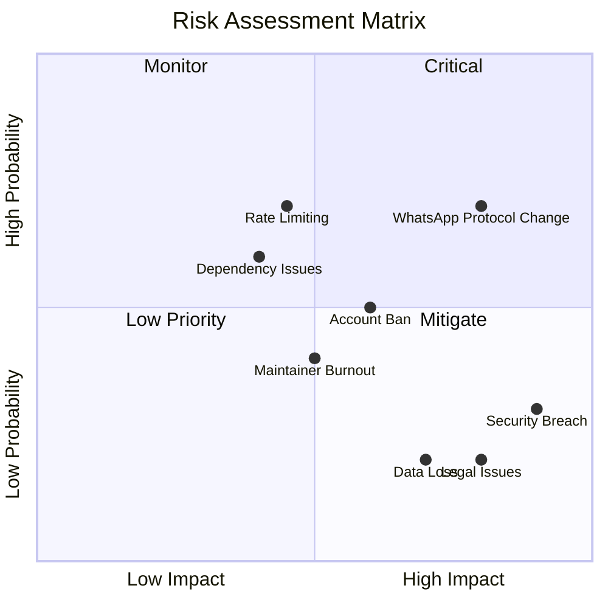

## 16.2 Risk Register

### R001: WhatsApp Protocol Changes

| Attribute       | Value      |
| --------------- | ---------- |
| **ID**          | R001       |
| **Category**    | Technical  |
| **Probability** | High (70%) |
| **Impact**      | High       |
| **Risk Level**  | Critical   |

**Description:**  
WhatsApp can change its Web and multi-device protocols at any time, which can stop either engine library (`whatsapp-web.js` or Baileys) from working. A step WhatsApp enforces server-side inside the linking handshake, such as the passkey prompt some accounts now get ([#560](https://github.com/rmyndharis/OpenWA/issues/560)), blocks new links on both engines at once.

**Indicators:**

- Spike in engine library issues (`whatsapp-web.js` or Baileys)
- Sudden increase in error rates
- Authentication failures
- New links stall at `qr_ready` on both engines (see [docs/12](./12-troubleshooting-faq.md#issue-linking-asks-for-a-passkey-and-never-completes-both-engines))

**Mitigation Strategies:**

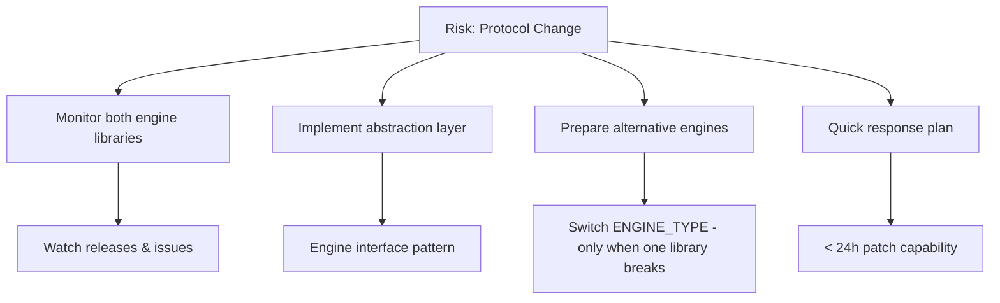

Switching `ENGINE_TYPE` (M3) helps only when one engine library breaks, and every session must then be linked again, because each engine keeps its own auth state. A gate WhatsApp enforces inside the linking handshake, such as the passkey step ([#560](https://github.com/rmyndharis/OpenWA/issues/560), upstream [WhiskeySockets/Baileys#2672](https://github.com/WhiskeySockets/Baileys/issues/2672)), stops new links on both engines; the fix has to come from the engine libraries, and operators rely on their fallback channel until then (see [Plan A](#plan-a-whatsapp-protocol-change)).

**Action Items:**

1. Subscribe to `whatsapp-web.js` and Baileys releases
2. Engine abstraction layer — implemented (pluggable `ENGINE_TYPE`: `whatsapp-web.js` default, `baileys` alternative)
3. Document fallback procedures
4. Maintain relationships with library maintainers

---

### R002: User Account Banned

| Attribute       | Value        |
| --------------- | ------------ |
| **ID**          | R002         |
| **Category**    | Operational  |
| **Probability** | Medium (50%) |
| **Impact**      | Medium       |
| **Risk Level**  | Medium       |

**Description:**  
WhatsApp users can be banned for using unofficial APIs or behavior detected as spam.

**Indicators:**

- User reports of banned accounts
- Sudden disconnections
- QR code fails for specific numbers

**Mitigation Strategies:**

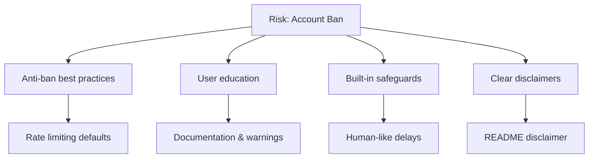

**Built-in Safeguards:**

```typescript
// src/modules/message/bulk-message.service.ts — bulk-send pacing defaults
const options = {
  delayBetweenMessages: dto.options?.delayBetweenMessages ?? 3000, // 3s (DTO range 1000–60000)
  randomizeDelay: dto.options?.randomizeDelay ?? true, // adds 0–2s jitter per message
  stopOnError: dto.options?.stopOnError ?? false,
};
```

Alongside that:

- `SIMULATE_TYPING` (on by default; `SIMULATE_TYPING_MAX_MS` default 5000) shows the engine's typing
  indicator and pauses for a length-scaled, jittered interval before a **text** send — `send-text`,
  and `send-template` only because it renders to text and delegates to the same path. Every other
  send (image, video, audio, document, sticker, location, contact, poll, reply, forward) reaches the
  engine with no typing indicator and no pause.
- `BULK_MAX_CONCURRENT_BATCHES` (default 50, `0` = unlimited) caps concurrent bulk batches per process.
- A single bulk request carries at most 100 messages (`@ArrayMaxSize(100)` on
  `SendBulkMessageDto.messages`); a 101st entry is rejected by the global `ValidationPipe` with HTTP 400.

Opt-in: `SEND_PACING_ENABLED=true` adds a per-UTC-day send cap whose allowance grows with the
session's age (`SEND_PACING_WARMUP_SCHEDULE`), a separate cap on new conversations
(`SEND_PACING_COLD_DAILY_CAP`) and a consecutive-failure breaker — see
[06 §Send pacing](./06-api-specification.md). It is **off by default**, and it counts only sends that
write a `messages` row, so status posts and message edits are checked against the cap without
counting into it. Clearing or deleting a chat removes its stored rows, so that chat's sends today
stop counting toward either cap, and the next send to it counts as a new conversation.

Still not implemented: there are no per-minute or per-hour caps and no media-specific delay. With
pacing off — the default — the guidelines below are operator discipline, not something the gateway
enforces.

**User Guidelines:**

```markdown
## Anti-Ban Best Practices

### DO ✅

- Warm up new numbers (normal usage for 1-2 weeks)
- Use realistic delays between messages
- Personalize messages (avoid identical content)
- Respond to incoming messages
- Use residential proxies if needed

### DON'T ❌

- Send bulk messages to unknown numbers
- Use identical message templates
- Send >100 messages/day on new numbers
- Ignore replies (one-way communication)
- Use datacenter IPs without proxy
```

---

### R003: Security Breach

| Attribute       | Value     |
| --------------- | --------- |
| **ID**          | R003      |
| **Category**    | Security  |
| **Probability** | Low (30%) |
| **Impact**      | Critical  |
| **Risk Level**  | Medium    |

**Description:**  
Security vulnerabilities may lead to unauthorized access to sessions, data, or infrastructure.

**Potential Vectors:**

- API key leakage
- SQL injection
- Insecure session storage
- Dependency vulnerabilities

**Mitigation Strategies:**

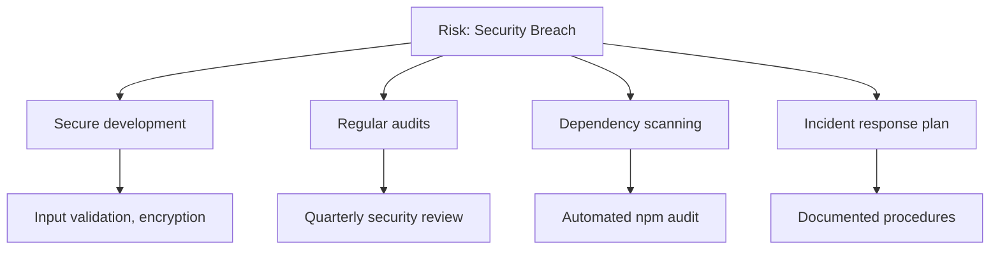

**Security Checklist:**

```markdown
## Security Review Checklist

### Code Security

- [ ] Input validation on all endpoints
- [ ] Parameterized database queries
- [ ] API key hashing (never plain storage)
- [ ] Sensitive data encryption
- [ ] No secrets in codebase

### Infrastructure Security

- [ ] HTTPS enforced
- [ ] Security headers configured
- [ ] Rate limiting enabled
- [ ] Firewall rules reviewed
- [ ] Access logs enabled

### Dependency Security

- [ ] npm audit clean
- [ ] Dependabot alerts reviewed
- [ ] Dependencies up to date
- [ ] No known vulnerabilities
```

**Incident Response Plan:**

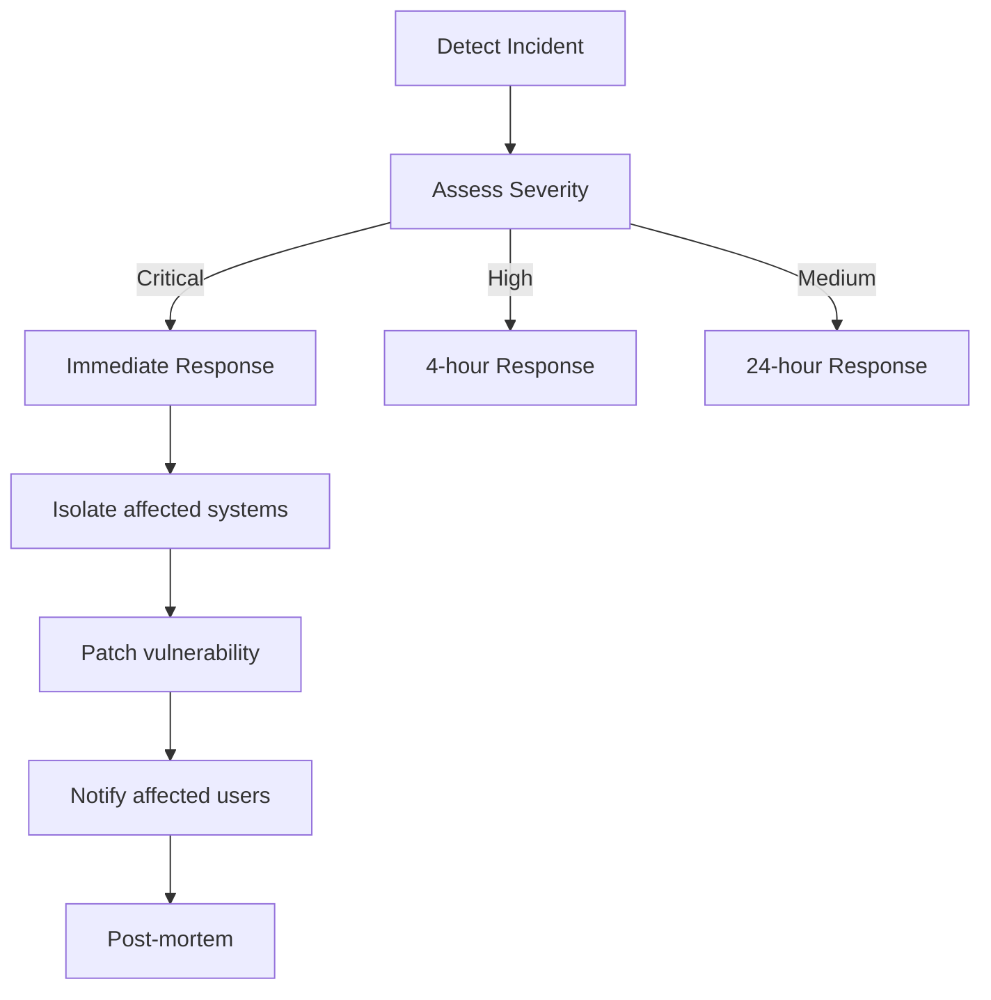

---

### R004: Maintainer Burnout

| Attribute       | Value          |
| --------------- | -------------- |
| **ID**          | R004           |
| **Category**    | Organizational |
| **Probability** | Medium (40%)   |
| **Impact**      | Medium         |
| **Risk Level**  | Medium         |

**Description:**  
An open-source project can stagnate if maintainers burn out or lack time.

**Indicators:**

- Increasing response time to issues
- PR review delays
- Reduced commit frequency
- Maintainer communication gaps

**Mitigation Strategies:**

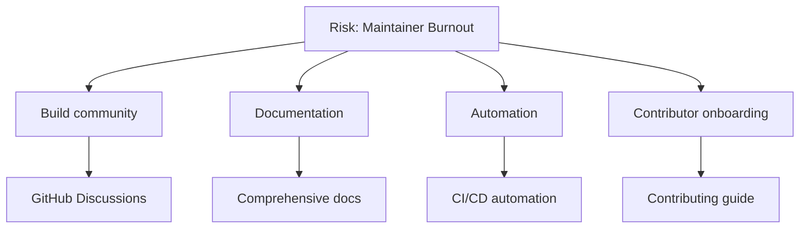

**Sustainability Measures:**

1. **Comprehensive Documentation**
   - Anyone can understand the codebase
   - Clear architecture decisions
   - Troubleshooting guides

2. **Automation**
   - Automated testing
   - Automated releases
   - Issue/PR templates

3. **Community Building**
   - Recognize contributors
   - Good first issues
   - GitHub Discussions for questions and design talk

4. **Bus Factor**
   - One maintainer today; a bus factor of 1 is the open risk
   - The docs, CI gates and tag-driven releases above are what let someone else pick the project up
   - Additional maintainers, ownership areas and succession planning are not in place yet

---

### R005: Dependency Vulnerabilities

| Attribute       | Value      |
| --------------- | ---------- |
| **ID**          | R005       |
| **Category**    | Technical  |
| **Probability** | High (60%) |
| **Impact**      | Medium     |
| **Risk Level**  | Medium     |

**Description:**  
Dependencies (`whatsapp-web.js`, Puppeteer, NestJS, etc.) may have vulnerabilities or breaking changes.

**Mitigation Strategies:**

> **Current state:** the real dependency check is a dedicated `audit` job in `ci.yml` running `npm run check:audit` over the root tree and `npm audit --audit-level=high` over `dashboard/` (on push and PR); it is deliberately split out of the `Lint` job so a newly published advisory cannot abort the other quality gates. `check:audit` keeps the `high` threshold but applies it per advisory, so one with no patched version can be excused by id in `scripts/check-audit.mjs` (with its reason and removal condition recorded, and a stale entry failing the job) instead of lowering the bar for everything. `release.yml` repeats both and additionally runs a Trivy image scan (`CRITICAL,HIGH`, `ignore-unfixed`) against an explicit `.trivyignore` before the release tags are promoted. Dependabot PRs cover npm for `/` and `/dashboard` (weekly), GitHub Actions (monthly), the Dockerfile base image and the `docker-compose.yml` images (weekly; PostgreSQL and Redis majors ignored, and a postgres, redis or pgsty/silo bump fails `compose-parity.spec.ts` until `src/modules/docker/docker.service.ts` carries the same image reference), with version-pinned ignores (seven in the root tree, two in `/dashboard`) whose reasons and lift conditions are recorded in `.github/dependabot.yml`. Between releases, `.github/workflows/security-scan.yml` (Scheduled Security Scan) runs every Wednesday at 03:00 UTC and on demand: it repeats the `audit` job and the release Trivy scan against the published `latest` image on amd64 and arm64, so an advisory those gates would block fails a run within a week of being published; the amd64 Chrome for Testing binary stays outside what Trivy can see (see `.trivyignore`). Its `base-image-drift` job fails when the Dockerfile's two `node:22-slim` FROM digests disagree, or when the pin differs from what the tag serves today and either the tag has served that image for 7 or more days, or for 3 or more days with the pin last changed 28 or more days ago; it backstops a Dependabot digest refresh that is late or left unmerged. There is **no** Snyk integration. The workflow below is a recommended enhancement to add Snyk; its scheduled `npm audit` is already covered by `security-scan.yml`.

```yaml
# .github/workflows/security.yml
name: Security Scan

on:
  schedule:
    - cron: '0 0 * * *' # Daily
  push:
    branches: [main]

jobs:
  audit:
    runs-on: ubuntu-latest
    steps:
      - uses: actions/checkout@v4

      - name: npm audit
        run: npm audit --audit-level=high

      - name: Snyk scan
        uses: snyk/actions/node@master
        env:
          SNYK_TOKEN: ${{ secrets.SNYK_TOKEN }}
```

**Dependency Management Policy:**

| Action                                                                                    | Frequency                    |
| ----------------------------------------------------------------------------------------- | ---------------------------- |
| npm audit (`high`, per-advisory allowlist via `check:audit`; dedicated `audit` job in CI) | Every push / PR              |
| Trivy image scan (`CRITICAL,HIGH`, `.trivyignore`)                                        | Every release                |
| Scheduled Security Scan (audit, Trivy on `latest` amd64 and arm64, base-image drift)      | Weekly (Wednesday 03:00 UTC) |
| Snyk scan                                                                                 | Not configured (planned)     |
| Dependabot PRs (npm: `/` and `/dashboard`; docker; docker-compose)                        | Weekly                       |
| Dependabot PRs (github-actions)                                                           | Monthly                      |
| Major updates                                                                             | Reviewed manually            |
| Security patches                                                                          | Immediate                    |

---

### R006: Legal/Compliance Issues

| Attribute       | Value     |
| --------------- | --------- |
| **ID**          | R006      |
| **Category**    | Legal     |
| **Probability** | Low (20%) |
| **Impact**      | Critical  |
| **Risk Level**  | Medium    |

**Description:**  
WhatsApp/Meta may take legal action against unofficial APIs, or users may misuse the system for illegal activities.

**Mitigation Strategies:**

1. **Published disclaimer**: the [README](../README.md#disclaimer), the project site (https://www.open-wa.org) and the SDK READMEs state that OpenWA is not affiliated with or endorsed by WhatsApp or Meta.
2. **No support for spam/illegal use cases**
3. **Built-in anti-abuse measures**

---

## 16.3 Risk Monitoring

### Monitoring Dashboard

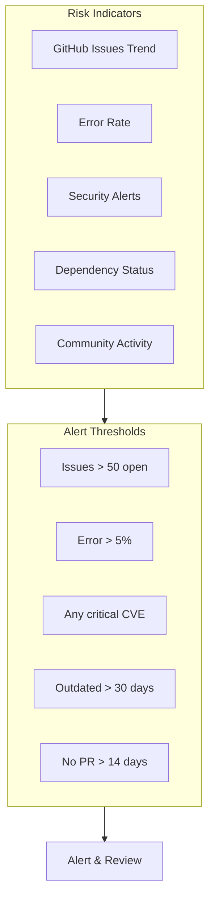

### Weekly Risk Review

Optional template: the project does not run this review on a schedule.

```markdown
## Weekly Risk Review Template

### Date: YYYY-MM-DD

### Technical Risks

- [ ] whatsapp-web.js status: ___
- [ ] Error rate trend: ___
- [ ] Security scan results: ___
- [ ] Dependency updates needed: ___

### Operational Risks

- [ ] User ban reports: ___
- [ ] Support ticket volume: ___
- [ ] Performance issues: ___

### Community Health

- [ ] Open issues: ___
- [ ] Open PRs: ___
- [ ] New contributors: ___
- [ ] Response time (avg): ___

### Actions Needed

1. ***
2. ***
3. ***
```

## 16.4 Contingency Plans

### Plan A: WhatsApp Protocol Change

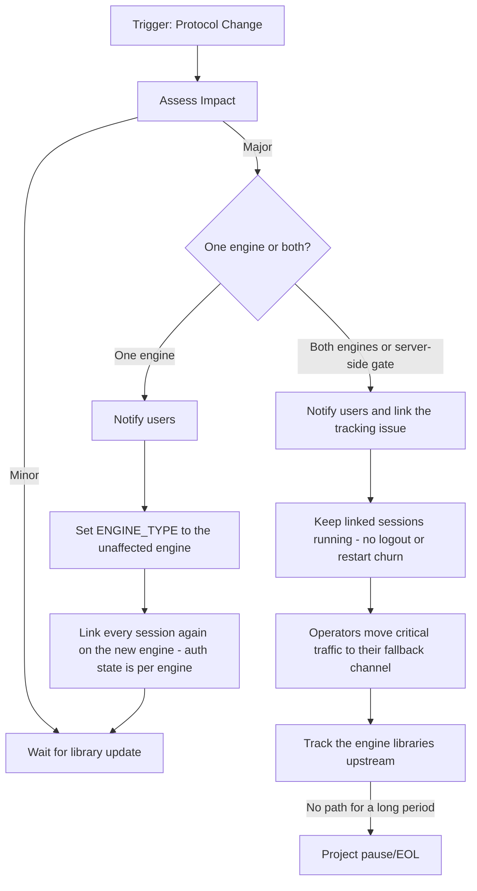

During a both-engines event keep linked sessions running rather than logging them out or deleting them: linking again may hit the same gate.

After a one-engine switch every session starts without credentials, because each engine keeps its own auth state. An account behind the passkey gate cannot link again, so keep it on the fallback channel.

### Plan B: Critical Security Vulnerability

```
Timeline: < 24 hours response

Hour 0-1:
- Assess severity
- Disable affected features if needed
- Notify critical users

Hour 1-4:
- Develop patch
- Test patch
- Prepare release

Hour 4-8:
- Deploy patch
- Notify all users
- Monitor for issues

Hour 8-24:
- Post-mortem
- Update procedures
- Additional hardening
```

### Plan C: Project Handover

```markdown
## Project Handover Checklist

### Documentation

- [ ] Architecture documented
- [ ] All decisions logged
- [ ] Deployment procedures
- [ ] Credentials inventory

### Access

- [ ] GitHub owner transfer
- [ ] Repository secrets: `DOCKERHUB_USERNAME`/`DOCKERHUB_TOKEN`, `RELEASE_PAT`, `MAVEN_CENTRAL_USERNAME`/`MAVEN_CENTRAL_PASSWORD`, `GPG_PRIVATE_KEY`/`GPG_PASSPHRASE`, `PHP_SDK_SPLIT_TOKEN`
- [ ] Registries: Docker Hub `rmyndharis/openwa`, npm `@rmyndharis/openwa` and PyPI `rmyndharis-openwa` (trusted publishers bound to this repository), Maven Central `com.rmyndharis`, Packagist `rmyndharis/openwa` via the `rmyndharis/openwa-php` mirror; GHCR images and Go module tags follow the GitHub repository
- [ ] Domain ownership
- [ ] Cloud accounts

### Knowledge Transfer

- [ ] Codebase walkthrough
- [ ] Known issues list
- [ ] Roadmap handover
- [ ] Community introduction
```

## 16.5 Additional Risk Mitigations

### R007: Rate Limiting & WhatsApp Throttling

| Attribute       | Value       |
| --------------- | ----------- |
| **ID**          | R007        |
| **Category**    | Operational |
| **Probability** | High (70%)  |
| **Impact**      | Medium      |
| **Risk Level**  | Medium      |

**Description:**
WhatsApp has undocumented internal rate limits. Sending too many messages can trigger temporary blocks or permanent bans.

**Built-in Safeguards:**

The gateway enforces HTTP request throttling (`@nestjs/throttler`, registered globally as
`ProxyAwareThrottlerGuard` and tracked per route handler and client IP) plus the bulk-send pacing described in R002:

| Control                                               | Default                    | Scope                                                         |
| ----------------------------------------------------- | -------------------------- | ------------------------------------------------------------- |
| `RATE_LIMIT_SHORT_TTL` / `RATE_LIMIT_SHORT_LIMIT`     | 1000 ms / 10 requests      | HTTP burst window                                             |
| `RATE_LIMIT_MEDIUM_TTL` / `RATE_LIMIT_MEDIUM_LIMIT`   | 60000 ms / 100 requests    | HTTP sustained window                                         |
| `RATE_LIMIT_LONG_TTL` / `RATE_LIMIT_LONG_LIMIT`       | 3600000 ms / 1000 requests | HTTP hourly window                                            |
| `delayBetweenMessages` / `randomizeDelay`             | 3000 ms + 0–2 s jitter     | Bulk send, between consecutive messages inside a batch        |
| `BULK_MAX_CONCURRENT_BATCHES`                         | 50 (`0` = unlimited)       | Concurrent bulk batches per process                           |
| `@ArrayMaxSize(100)` on `SendBulkMessageDto.messages` | 100 messages (hard limit)  | Messages accepted per bulk request                            |
| `SIMULATE_TYPING` / `SIMULATE_TYPING_MAX_MS`          | on / 5000 ms               | Typing pause, text sends only (`send-text` / `send-template`) |

These bound API traffic and bulk pacing — they are **not** per-session WhatsApp send caps. The
gateway counts no messages per minute or hour, and counts per UTC day only when
`SEND_PACING_ENABLED=true`, which is off by default; with it off, staying inside WhatsApp's
undocumented limits remains entirely the operator's responsibility. The thresholds below are targets
for operator-side monitoring, not values the gateway enforces.

**Monitoring Metrics:**

| Metric              | Warning Threshold | Critical Threshold |
| ------------------- | ----------------- | ------------------ |
| Messages per minute | > 15              | > 25               |
| Failed sends        | > 5%              | > 15%              |
| Connection drops    | > 2/hour          | > 5/hour           |
| QR re-auth requests | > 1/day           | > 3/day            |

---

### R008: Data Loss

| Attribute       | Value     |
| --------------- | --------- |
| **ID**          | R008      |
| **Category**    | Technical |
| **Probability** | Low (20%) |
| **Impact**      | High      |
| **Risk Level**  | Medium    |

**Mitigation Strategy:**

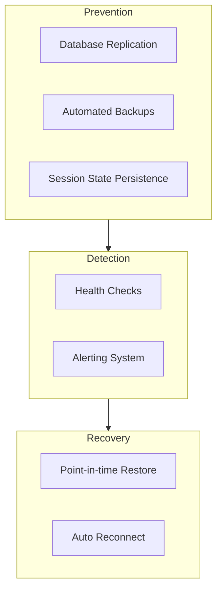

**Backup Coverage:**

| Data Type                                                                                   | Frequency                                                                     | Retention                                            | Storage                                                                                                                |
| ------------------------------------------------------------------------------------------- | ----------------------------------------------------------------------------- | ---------------------------------------------------- | ---------------------------------------------------------------------------------------------------------------------- |
| Databases (`main.sqlite` plus the data store, or a `pg_dump` when `DATABASE_TYPE=postgres`) | Each operator-run of `scripts/backup.sh` — the repo ships no scheduled backup | Whatever the operator keeps; the script never prunes | One `openwa-backup-<timestamp>.tar.gz` under `BACKUP_DIR` (default `./backups`) — local disk, no object-storage upload |
| Session auth state                                                                          | On change                                                                     | Indefinite                                           | Filesystem — `SESSION_DATA_PATH` (default `./data/sessions`), `BAILEYS_AUTH_DIR` (default `./data/baileys`)            |
| Configuration                                                                               | On change                                                                     | Indefinite                                           | Git                                                                                                                    |

> Session auth state is **not** in the database: whatsapp-web.js `LocalAuth` writes under
> `SESSION_DATA_PATH` and Baileys writes multi-file auth state under `BAILEYS_AUTH_DIR/<sessionId>`.
> A database-only backup loses every pairing — those directories must be in the file-level backup.
> `scripts/backup.sh` already captures both alongside the databases. Running it on a schedule and
> copying the archives off-box are the operator's responsibility.

---

## 16.6 Escalation Procedures

Optional template: the project does not run this process. OpenWA has one maintainer and no on-call
rotation, paging, chat channel or status page; incidents are handled through GitHub Issues, and security
reports through GitHub Security Advisories (see [SECURITY.md](../SECURITY.md)).

### Severity Levels

| Level             | Description              | Response Time | Notification  |
| ----------------- | ------------------------ | ------------- | ------------- |
| **P1 - Critical** | System down, data breach | < 15 minutes  | Phone + Slack |
| **P2 - High**     | Major feature broken     | < 1 hour      | Slack + Email |
| **P3 - Medium**   | Feature degraded         | < 4 hours     | Slack         |
| **P4 - Low**      | Minor issue              | < 24 hours    | GitHub Issue  |

### Escalation Flow

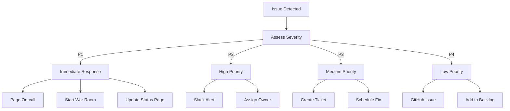

### On-Call Rotation

```yaml
# Example PagerDuty/Opsgenie configuration
schedule:
  name: 'OpenWA On-Call'
  rotation:
    - week: 1
      primary: 'developer-a'
      secondary: 'developer-b'
    - week: 2
      primary: 'developer-b'
      secondary: 'developer-a'

escalation:
  - level: 1
    wait: 5m
    target: primary
  - level: 2
    wait: 10m
    target: secondary
  - level: 3
    wait: 15m
    target: all-team
```

---

## 16.7 Risk Dashboard

### Key Risk Indicators (KRI)

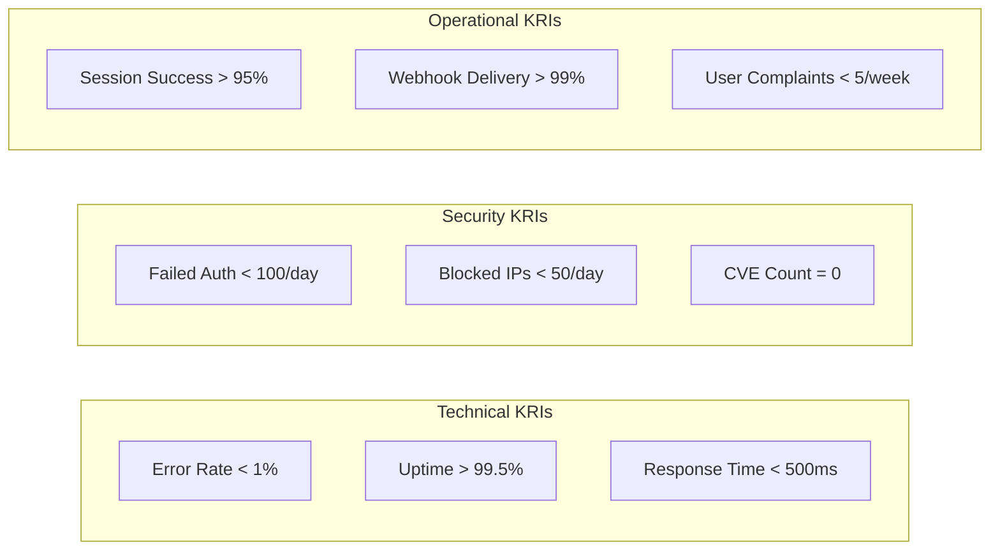

### Weekly Risk Report Template

Optional template: the project does not run this review on a schedule.

```markdown
## Weekly Risk Report - Week XX

### Summary

- Overall Risk Status: 🟢 Green / 🟡 Yellow / 🔴 Red
- New Risks Identified: X
- Risks Mitigated: X
- Active Incidents: X

### KRI Status

| KRI           | Target  | Actual | Status   |
| ------------- | ------- | ------ | -------- |
| Error Rate    | < 1%    | X.XX%  | 🟢/🟡/🔴 |
| Uptime        | > 99.5% | XX.XX% | 🟢/🟡/🔴 |
| Response Time | < 500ms | XXXms  | 🟢/🟡/🔴 |

### Top Risks This Week

1. **Risk Name**
   - Status: Monitoring/Mitigating/Resolved
   - Action: [Description]

### Dependencies Update

| Dependency      | Current | Latest | CVEs | Action |
| --------------- | ------- | ------ | ---- | ------ |
| whatsapp-web.js | X.X.X   | X.X.X  | 0    | OK     |
| puppeteer       | X.X.X   | X.X.X  | 0    | OK     |

### Action Items

- [ ] Action 1
- [ ] Action 2
```

---

## 16.8 Risk Summary

| ID   | Risk               | Probability | Impact   | Level       | Status              |
| ---- | ------------------ | ----------- | -------- | ----------- | ------------------- |
| R001 | Protocol Changes   | High        | High     | 🔴 Critical | Monitoring          |
| R002 | Account Ban        | Medium      | Medium   | 🟡 Medium   | Partially mitigated |
| R003 | Security Breach    | Low         | Critical | 🟡 Medium   | Mitigated           |
| R004 | Maintainer Burnout | Medium      | Medium   | 🟡 Medium   | Planning            |
| R005 | Dependency Issues  | High        | Medium   | 🟡 Medium   | Automated           |
| R006 | Legal Issues       | Low         | Critical | 🟡 Medium   | Mitigated           |
| R007 | Rate Limiting      | High        | Medium   | 🟡 Medium   | Partially mitigated |
| R008 | Data Loss          | Low         | High     | 🟡 Medium   | Mitigated           |

---

<div align="center">

[← 15 - Project Roadmap](./15-project-roadmap.md) · [Documentation Index](./README.md) · [Next: 17 - Dashboard Design →](./17-dashboard-design.md)

</div>
