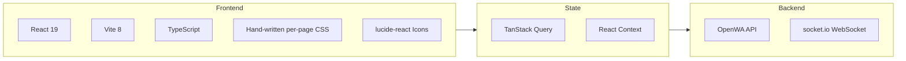
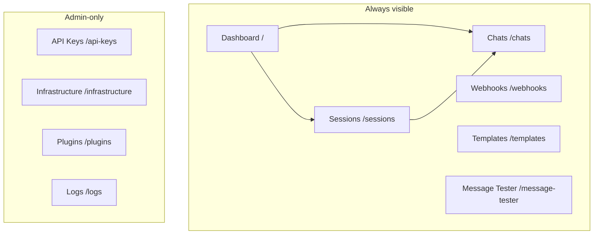

# 17 - Dashboard Design

## 17.1 Overview

The dashboard is a web-based management interface for OpenWA that lets users manage sessions, webhooks, and monitor activity without using the API directly.

### Tech Stack



The styling foundation is **plain CSS** — there is no Tailwind, no shadcn/ui, and no CSS-in-JS.
Every page — and most shared components — ships its own stylesheet colocated beside the source
(`Sessions.tsx` + `Sessions.css`, `Layout.tsx` + `Layout.css`, ...), imported directly by the
component (see §17.4 for the handful that carry no stylesheet of their own). Icons come from
`lucide-react`; charts from `recharts`; i18n from `react-i18next`.
Client state is **TanStack Query** for most server data (see `src/hooks/queries.ts`; §17.5 names the
pages that keep their own copy) plus two small React
Context providers (`RoleProvider`, `ToastProvider`); theme mode is a provider-less `useTheme` hook
backed by `localStorage` — there is no Zustand store.

### Design Principles

1. **Minimalist** - Clean, uncluttered interface
2. **Responsive** - Works on desktop and mobile
3. **Real-time** - Live updates via WebSocket
4. **Accessible** - built to WCAG 2.1 AA as the target. Shipped: full keyboard reachability of
   the chat/channel/status lists (role, focus, Enter/Space activation), focus-visible styling, the
   form labels in the settings and config surfaces associated with their controls via `htmlFor`/`id`,
   toggle switches and button groups that expose an accessible name and their selected state, and a
   muted-text token that meets AA on both themes. `dashboard/src/a11y-controls.test.ts` fails the
   build when a toggle switch, a button toggle-group or a plugin config field loses its name; other
   control shapes are not covered by it.
   Brand and status colours are split in two: `--primary`, `--error`, `--success` and `--warning` are
   fill colours for buttons, borders and tints, and `--primary-text`, `--error-text`, `--success-text`
   and `--warning-text` are darkened twins for anything rendered as text or an icon. As foregrounds
   the originals measure 1.98:1, 3.76:1, 2.28:1 and 2.15:1 on white. Each twin is set from the
   darkest surface it actually lands on, which is the 10 to 20 percent tint of its own hue that the
   badges and callouts paint behind it, not white. Dark restates primary, success and warning as the
   originals, which are 6:1 or better on the dark surfaces, and lightens error to `#f77b7b`, which
   clears 4.65:1 on the 20 percent error tint over Slate 800, because the original measures 3.89:1
   on Slate 800 (`#1e293b`), the dark card surface.
   Known gap: the exclusive button groups report `aria-pressed` without arrow-key roving focus. Every
   page has a render test, but only Infrastructure's resolves the caption references
   against a real DOM; elsewhere they are checked structurally. Treat the claim as directional, not
   certified.
5. **Dark mode** - Support for light/dark themes

## 17.2 Information Architecture

The dashboard is a **flat, single-level route table** (see `src/App.tsx`). Each sidebar entry maps
to one top-level page — there are no nested detail/`:id` routes; a session or chat is opened in-place
(modals / split panes) rather than via its own URL.



### Navigation Structure

The route table lives in `src/App.tsx`; the sidebar items in `src/components/Layout.tsx`. Routes
guarded by `role === 'admin'` are only mounted (and only shown in the sidebar) for an admin key —
a non-admin hitting the path falls through to the `*` redirect. API Keys, Infrastructure and Plugins
also need a key not restricted to selected sessions (`role === 'admin' && !scoped`, with `scoped`
from `POST /api/auth/validate`), because their routes refuse a session-scoped key; `/logs` is
mounted for any admin key.

```
/                  → Dashboard (overview + charts)
/sessions          → Sessions (create / start / stop / QR / delete)
/chats             → Chats (Chats / Channels / Status tabs; chat list + message thread live via
                     WebSocket; thread pages older history in on scroll-up; read-only channel
                     feed on whatsapp-web.js)
/webhooks          → Webhooks (per-session webhook endpoints)
/templates         → Message Templates
/message-tester    → Message Tester (ad-hoc send-* + check-number)
/logs              → Activity / Audit Logs            [admin only]
/api-keys          → API Keys Management              [admin, unscoped key only]
/infrastructure    → Infrastructure status & config   [admin, unscoped key only]
/plugins           → Plugins (install / enable / configure) [admin, unscoped key only]
*                  → redirect to /
```

> There is **no Settings page** and no `/sessions/:id`, `/sessions/:id/chat`, or `/webhooks/:id`
> route. Theme (light/dark/system) is a one-click toggle in the sidebar footer (`Layout.tsx`),
> persisted client-side by the `useTheme` hook.

## 17.3 Wireframes

### Dashboard Home

```
┌─────────────────────────────────────────────────────────────────────┐
│  🔵 OpenWA                              🔍 Search    👤 Admin    ☀️  │
├─────────────────────────────────────────────────────────────────────┤
│                                                                      │
│  ┌─────────────┬─────────────┬─────────────┬─────────────┐          │
│  │   📱 5      │   ✅ 4      │   📨 1,234  │   🔗 3      │          │
│  │  Sessions   │  Connected  │   Messages  │  Webhooks   │          │
│  │             │             │   (Today)   │   Active    │          │
│  └─────────────┴─────────────┴─────────────┴─────────────┘          │
│                                                                      │
│  ┌──────────────────────────────────┐ ┌────────────────────────┐    │
│  │  Sessions Overview               │ │  Recent Activity       │    │
│  │  ┌──────┬──────┬──────┬──────┐  │ │                        │    │
│  │  │ 🟢   │ 🟢   │ 🟢   │ 🟡   │  │ │  10:30 Message sent    │    │
│  │  │ CS-1 │ CS-2 │ Sales│ Supp │  │ │  10:28 Webhook called  │    │
│  │  │ 123  │ 456  │  789 │  -   │  │ │  10:25 Session online  │    │
│  │  └──────┴──────┴──────┴──────┘  │ │  10:20 Message recv    │    │
│  │                                  │ │  10:15 QR scanned      │    │
│  │  [+ New Session]                 │ │                        │    │
│  └──────────────────────────────────┘ │  [View All →]          │    │
│                                        └────────────────────────┘    │
│                                                                      │
│  ┌──────────────────────────────────────────────────────────────┐   │
│  │  Message Volume (Last 7 Days)                                 │   │
│  │  ┌────────────────────────────────────────────────────────┐  │   │
│  │  │    ▓▓                                                   │  │   │
│  │  │    ▓▓     ▓▓                      ▓▓                   │  │   │
│  │  │    ▓▓     ▓▓  ▓▓            ▓▓    ▓▓                   │  │   │
│  │  │ ▓▓▓▓  ▓▓  ▓▓  ▓▓  ▓▓  ▓▓  ▓▓    ▓▓  ▓▓               │  │   │
│  │  │ Mon   Tue Wed Thu Fri  Sat Sun                         │  │   │
│  │  └────────────────────────────────────────────────────────┘  │   │
│  └──────────────────────────────────────────────────────────────┘   │
│                                                                      │
└─────────────────────────────────────────────────────────────────────┘
```

### Session List

```
┌─────────────────────────────────────────────────────────────────────┐
│  ← Sessions                                        [+ New Session]   │
├─────────────────────────────────────────────────────────────────────┤
│                                                                      │
│  🔍 Search sessions...              Filter: [All ▾] [Status ▾]      │
│                                                                      │
│  ┌───────────────────────────────────────────────────────────────┐  │
│  │ ● Customer Support 1                              🟢 Connected │  │
│  │   📱 +62 812-3456-789                                          │  │
│  │   📨 1,234 messages | Last active: 2 min ago                   │  │
│  │   ─────────────────────────────────────────────────────────── │  │
│  │   [📷 QR] [💬 Test Chat] [⚙️ Settings] [🗑️ Delete]             │  │
│  └───────────────────────────────────────────────────────────────┘  │
│                                                                      │
│  ┌───────────────────────────────────────────────────────────────┐  │
│  │ ● Sales Bot                                       🟢 Connected │  │
│  │   📱 +62 821-9876-543                                          │  │
│  │   📨 567 messages | Last active: 5 min ago                     │  │
│  │   ─────────────────────────────────────────────────────────── │  │
│  │   [📷 QR] [💬 Test Chat] [⚙️ Settings] [🗑️ Delete]             │  │
│  └───────────────────────────────────────────────────────────────┘  │
│                                                                      │
│  ┌───────────────────────────────────────────────────────────────┐  │
│  │ ○ Support Backup                              🟡 Disconnected  │  │
│  │   📱 Not connected                                             │  │
│  │   📨 0 messages | Never active                                 │  │
│  │   ─────────────────────────────────────────────────────────── │  │
│  │   [📷 Scan QR] [⚙️ Settings] [🗑️ Delete]                       │  │
│  └───────────────────────────────────────────────────────────────┘  │
│                                                                      │
│  ────────────────────────────────────────────────────────────────   │
│  Showing 3 of 3 sessions                              [◀] 1 [▶]     │
│                                                                      │
└─────────────────────────────────────────────────────────────────────┘
```

### Session Detail

```
┌─────────────────────────────────────────────────────────────────────┐
│  ← Sessions / Customer Support 1                    🟢 Connected     │
├─────────────────────────────────────────────────────────────────────┤
│                                                                      │
│  ┌─────────────────────────────────────────────────────────────┐    │
│  │  ┌─────────┐                                                │    │
│  │  │  👤     │  Customer Support 1                            │    │
│  │  │ Avatar  │  +62 812-3456-789                              │    │
│  │  │         │  Status: 🟢 Connected                          │    │
│  │  └─────────┘  Platform: Android                             │    │
│  │                                                              │    │
│  │  [Restart Session] [Unlink Device] [Delete]                  │    │
│  └─────────────────────────────────────────────────────────────┘    │
│                                                                      │
│  Unlink Device attempts an engine-native unlink of this companion   │
│  device (POST /sessions/:sessionId/logout), then stops the          │
│  session. A 200 means the unlink + local cleanup completed (not an  │
│  independent Linked-Devices observation) — reconnecting then        │
│  requires a fresh QR scan or pairing code. A 502                    │
│  (SESSION_LOGOUT_INCOMPLETE) stops locally but leaves the           │
│  operation incomplete; retry after starting. Delete only clears     │
│  the local data; it does NOT unlink.                                │
│                                                                      │
│  ┌─────────────────────┬─────────────────────┐                      │
│  │  📊 Statistics      │  ⚙️ Configuration    │                      │
│  ├─────────────────────┼─────────────────────┤                      │
│  │                     │                     │                      │
│  │  Messages Sent      │  Auto Reconnect     │                      │
│  │  ████████░░ 1,234   │  [✓] Enabled        │                      │
│  │                     │                     │                      │
│  │  Messages Received  │  Webhook URL        │                      │
│  │  ██████████ 2,567   │  https://...        │                      │
│  │                     │                     │                      │
│  │  Webhook Calls      │  Proxy              │                      │
│  │  ███████░░░   890   │  None               │                      │
│  │                     │                     │                      │
│  │  Uptime             │  Created            │                      │
│  │  99.9% (30 days)    │  2026-01-15         │                      │
│  │                     │                     │                      │
│  └─────────────────────┴─────────────────────┘                      │
│                                                                      │
│  ┌─────────────────────────────────────────────────────────────┐    │
│  │  Recent Messages                          [View All →]      │    │
│  │  ───────────────────────────────────────────────────────── │    │
│  │  → +62 821... | Hello, how can I help?     | 10:30 ✓✓      │    │
│  │  ← +62 821... | I need product info        | 10:28          │    │
│  │  → +62 821... | Sure! Here's our catalog   | 10:25 ✓✓      │    │
│  │  ← +62 813... | Thanks for your help!      | 10:20          │    │
│  └─────────────────────────────────────────────────────────────┘    │
│                                                                      │
│  [💬 Open Test Chat]                                                 │
│                                                                      │
└─────────────────────────────────────────────────────────────────────┘
```

### QR Code Scanner

```
┌─────────────────────────────────────────────────────────────────────┐
│                          Scan QR Code                                │
├─────────────────────────────────────────────────────────────────────┤
│                                                                      │
│                    ┌─────────────────────────┐                       │
│                    │                         │                       │
│                    │   ████████████████████  │                       │
│                    │   ██              ████  │                       │
│                    │   ██  ██████████  ████  │                       │
│                    │   ██  ██      ██  ████  │                       │
│                    │   ██  ██      ██  ████  │                       │
│                    │   ██  ██      ██  ████  │                       │
│                    │   ██  ██████████  ████  │                       │
│                    │   ██              ████  │                       │
│                    │   ████████████████████  │                       │
│                    │                         │                       │
│                    └─────────────────────────┘                       │
│                                                                      │
│                    Expires in: 0:45                                  │
│                                                                      │
│     ──────────────────────────────────────────────────────          │
│                                                                      │
│     1. Open WhatsApp on your phone                                   │
│     2. Tap Menu ⋮ or Settings ⚙                                     │
│     3. Tap Linked Devices                                            │
│     4. Tap Link a Device                                             │
│     5. Point your phone at this screen                               │
│                                                                      │
│     ──────────────────────────────────────────────────────          │
│                                                                      │
│                    [Refresh QR] [Cancel]                             │
│                                                                      │
└─────────────────────────────────────────────────────────────────────┘
```

### Test Chat Interface

```
┌─────────────────────────────────────────────────────────────────────┐
│  ← Test Chat                              Session: Customer Support  │
├─────────────────────────────────────────────────────────────────────┤
│                                                                      │
│  ┌──────────────────────┐ ┌────────────────────────────────────┐    │
│  │  Contacts            │ │  +62 821-9876-543                  │    │
│  │  ──────────────────  │ │  John Doe                          │    │
│  │                      │ ├────────────────────────────────────┤    │
│  │  🔍 Search...        │ │                                    │    │
│  │                      │ │  ┌──────────────────────────────┐ │    │
│  │  ┌────────────────┐  │ │  │ Hello! How can I help you?  │ │    │
│  │  │ 👤 John Doe    │  │ │  │                    10:30 ✓✓ │ │    │
│  │  │    Last: Hi!   │  │ │  └──────────────────────────────┘ │    │
│  │  └────────────────┘  │ │                                    │    │
│  │                      │ │      ┌─────────────────────────┐   │    │
│  │  ┌────────────────┐  │ │      │ I need help with my    │   │    │
│  │  │ 👤 Jane Smith  │  │ │      │ order #12345           │   │    │
│  │  │    Last: OK    │  │ │      │              10:31     │   │    │
│  │  └────────────────┘  │ │      └─────────────────────────┘   │    │
│  │                      │ │                                    │    │
│  │  ┌────────────────┐  │ │  ┌──────────────────────────────┐ │    │
│  │  │ 👤 Bob Wilson  │  │ │  │ Sure! Let me check that    │ │    │
│  │  │    Last: Thx   │  │ │  │ for you. One moment...     │ │    │
│  │  └────────────────┘  │ │  │                    10:32 ✓✓ │ │    │
│  │                      │ │  └──────────────────────────────┘ │    │
│  │                      │ │                                    │    │
│  │  ──────────────────  │ ├────────────────────────────────────┤    │
│  │  [+ New Chat]        │ │  📎 [                        ] 📤  │    │
│  └──────────────────────┘ │     Type a message...              │    │
│                           └────────────────────────────────────┘    │
│                                                                      │
└─────────────────────────────────────────────────────────────────────┘
```

### Webhook Management

```
┌─────────────────────────────────────────────────────────────────────┐
│  ← Webhooks                                      [+ New Webhook]     │
├─────────────────────────────────────────────────────────────────────┤
│                                                                      │
│  ┌───────────────────────────────────────────────────────────────┐  │
│  │  🔗 Main Webhook                                   ✅ Active   │  │
│  │  https://api.example.com/webhook/openwa                        │  │
│  │  Events: message.received, message.ack, session.status         │  │
│  │  Sessions: All                                                 │  │
│  │  ──────────────────────────────────────────────────────────── │  │
│  │  Success Rate: 99.8% | Avg Latency: 125ms | Last: 2 min ago   │  │
│  │  [Test] [View Logs] [Edit] [Disable]                          │  │
│  └───────────────────────────────────────────────────────────────┘  │
│                                                                      │
│  ┌───────────────────────────────────────────────────────────────┐  │
│  │  🔗 Analytics Webhook                              ✅ Active   │  │
│  │  https://analytics.example.com/track                           │  │
│  │  Events: message.received                                      │  │
│  │  Sessions: cs-1, sales                                         │  │
│  │  ──────────────────────────────────────────────────────────── │  │
│  │  Success Rate: 100% | Avg Latency: 89ms | Last: 5 min ago     │  │
│  │  [Test] [View Logs] [Edit] [Disable]                          │  │
│  └───────────────────────────────────────────────────────────────┘  │
│                                                                      │
│  ┌───────────────────────────────────────────────────────────────┐  │
│  │  🔗 Backup Webhook                              ⏸️ Disabled    │  │
│  │  https://backup.example.com/wa                                 │  │
│  │  Events: message.received, message.ack                         │  │
│  │  Sessions: All                                                 │  │
│  │  ──────────────────────────────────────────────────────────── │  │
│  │  [Enable] [Edit] [Delete]                                     │  │
│  └───────────────────────────────────────────────────────────────┘  │
│                                                                      │
└─────────────────────────────────────────────────────────────────────┘
```

## 17.4 Component Library

> **No component framework is installed.** shadcn/ui is _not_ adopted — there is no `npx shadcn`
> init, no `components/ui/` directory, no `cn()` utility, and no `@/components` import alias. The
> wireframes above are design intent; the implementation is hand-written.

### Bespoke components

The UI is built from a small set of project-specific components under `dashboard/src/components/`,
most with a colocated CSS file. Six top-level components ship none: `ErrorBoundary` styles inline
via `style={{...}}`, `GithubIcon` carries no styling beyond `fill="currentColor"`, `Modal` reuses the
global `.modal-*` rules from `index.css`, `GroupPicker` and `SessionScopePicker` are styled by the
one page that uses each (`pages/MessageTester.css`, `pages/ApiKeys.css`), and `RoleProvider` renders
no DOM. Nothing under `chats/` ships its own stylesheet either: those components take their classes
from `pages/Chats.css`, and `MediaLightbox` adds the `yet-another-react-lightbox` vendor CSS. There
is no design-system package to pull from.

| Component                    | File                                | Responsibility                                                                                                               |
| ---------------------------- | ----------------------------------- | ---------------------------------------------------------------------------------------------------------------------------- |
| `Layout`                     | `components/Layout.tsx`             | App shell: collapsible sidebar nav, mobile drawer, language menu, light/dark/system theme toggle, logout, live version badge |
| `ToastProvider` / `useToast` | `components/Toast.tsx`              | Context-based toast notifications (success/error/warning/info) with de-dup keys                                              |
| `PageHeader`                 | `components/PageHeader.tsx`         | Shared page title / subtitle / badge / actions header                                                                        |
| `Modal`                      | `components/Modal.tsx`              | Accessible dialog (`role="dialog"`, Escape/overlay close, focus trap + restore); uses the global `.modal-*` styles           |
| `CustomSelect`               | `components/CustomSelect.tsx`       | Keyboard-navigable select replacement (type-ahead, arrow keys) used by Sessions / Logs / Login                               |
| `DashboardCharts`            | `components/DashboardCharts.tsx`    | `recharts`-based message-volume / activity charts on the Dashboard                                                           |
| `FilterBuilder`              | `components/FilterBuilder.tsx`      | Visual condition builder for webhook event filters                                                                           |
| `GlobalSearch`               | `components/GlobalSearch.tsx`       | Debounced message-search box in the Chats header, with all-sessions / current-session scope                                  |
| `PluginInstances`            | `components/PluginInstances.tsx`    | Per-plugin instance list: create / edit / delete and secret regeneration                                                     |
| `ErrorBoundary`              | `components/ErrorBoundary.tsx`      | Top-level React error boundary wrapping the whole app                                                                        |
| `GithubIcon`                 | `components/GithubIcon.tsx`         | Inline brand SVG                                                                                                             |
| `GroupPicker`                | `components/GroupPicker.tsx`        | Searchable multi-select of a session's groups, used by the Message Tester's multi-group send                                 |
| `SessionScopePicker`         | `components/SessionScopePicker.tsx` | Per-key session scope checklist on the API Keys page                                                                         |
| `RoleProvider`               | `components/RoleProvider.tsx`       | Context holding the logged-in key's role, read with `useRole` (`canWrite` gates write actions)                               |

Chat-specific pieces live one level down in `components/chats/`: `MessageBody` (WhatsApp text
formatting + link detection), `ChatThread` (bubble list, including inbound Baileys prompt buttons
that call `POST /sessions/:id/messages/click-button`), and `MediaLightbox` (the media viewer, built
on `yet-another-react-lightbox`). The rest of the room is split the same way: `ChatSidebar`,
`ChatComposer`, `ChatAvatar`, `KindIcon`, `StatusComposeModal` and `StatusMedia`. Prompt choices
arrive on live `message.received` as top-level `buttons` and are also stored in message
`metadata.buttons` so a reload can re-render them. Clicking still requires the prompt to be in the
engine store; an evicted prompt 404s. A read-only key sees the choices disabled and gets no reply,
react or delete actions, the same as the disabled composer.

The message thread is paged. `useChatMessages` is a `useInfiniteQuery` whose cursor is the number
of DB rows fetched so far, not the length of the rendered list — the thread also carries engine
history and drops the duplicates between the two, so its length is not an offset the gateway would
agree with. Reaching the top requests the next page; the reading position is held across the
prepend rather than jumping. Both rules are pure functions with tests: `utils/messagePages.ts` for
the cursor, `shouldFetchOlderMessages` in `utils/scrollDecision.ts` for when to ask.

Pages live under `dashboard/src/pages/`, each as a `*.tsx` + `*.css` pair (e.g. `Sessions.tsx` +
`Sessions.css`). Pages are lazy-loaded in `App.tsx` via `React.lazy` + `Suspense`.

A representative bespoke component — the shared page header — shows the actual conventions
(plain props, a colocated stylesheet, BEM-ish class names, no utility classes):

```typescript
// components/PageHeader.tsx
import type { ReactNode } from 'react';
import './PageHeader.css';

interface PageHeaderProps {
  title: string;
  subtitle?: string;
  badge?: ReactNode;
  actions?: ReactNode;
}

export function PageHeader({ title, subtitle, badge, actions }: PageHeaderProps) {
  return (
    <header className="page-header">
      <div className="page-header__title-group">
        <h1>{title}</h1>
        {badge && <span className="page-header__badge">{badge}</span>}
      </div>
      {actions && <div className="page-header__actions">{actions}</div>}
      {subtitle && <p className="page-header__subtitle">{subtitle}</p>}
    </header>
  );
}
```

Icons are imported individually from `lucide-react`; there is no `Avatar`/`Card`/`Badge` primitive
library — those visuals are composed directly with `div`s and the page's own CSS.

## 17.5 State Management

There is **no Zustand store** (and no global client-state library). Most server data is owned by
**TanStack Query** (`@tanstack/react-query`); the only other shared state lives in the two React
Context providers in the app — `RoleProvider` (the authenticated key's role, read through the
`useRole` hook) and `ToastProvider` (transient notifications). Theme mode is deliberately _not_ a
context: `useTheme` is a plain hook that persists to `localStorage` and writes one attribute on
`<html>` (see §17.7).

Three pages keep a server list in local state instead of the query cache:

- **Sessions** (`Sessions.tsx`) holds the session list itself and sequences each read against its
  own row writes and socket pushes, so an older answer never overwrites a newer row. After each read
  it applies, it invalidates the `['sessions']` key prefix so the Dashboard and per-session views
  refetch.
- **Chats** (`Chats.tsx`) reads the ready sessions directly on mount, and again when a search hit
  names a session that list lacks, and keeps the chat list in local state that socket pushes, sends
  and marking a chat read update.
- **Plugins** (`Plugins.tsx`) keeps the catalog in local state. It prefetches it silently on mount
  so installed cards can show an update chip, fetches it again when the Catalog tab opens with an
  empty list, and reloads it after any install, update or uninstall.

### API client — raw payloads, no `{ data }` envelope

The client lives in `src/services/api.ts`. A single `request<T>()` helper attaches the `X-API-Key`
header from `sessionStorage`, then returns **the parsed JSON body as-is** — the backend sends the
raw handler payload, so `request<Session[]>('/sessions')` resolves to a bare `Session[]`, not
`{ data: Session[] }`. (A `204 No Content` resolves to `undefined`; a `401`, or a `403` because the
key's `allowedIps` refuse this client, clears the stored key and redirects to login; any other `403`
leaves the key in place.) Endpoints are grouped into typed namespaces — `sessionApi`, `webhookApi`,
`templateApi`, `apiKeyApi`, `auditApi`, `messageApi`, `infraApi`, `pluginsApi`, `statsApi`, ...

```typescript
// src/services/api.ts (abridged)
export const API_BASE_URL = `${(import.meta.env.VITE_API_URL ?? '').replace(/\/+$/, '')}/api`;

async function request<T>(endpoint: string, options: RequestInit = {}): Promise<T> {
  const apiKey = sessionStorage.getItem('openwa_api_key');
  const response = await fetch(`${API_BASE_URL}${endpoint}`, {
    ...options,
    headers: {
      'Content-Type': 'application/json',
      ...(apiKey ? { 'X-API-Key': apiKey } : {}),
      ...options.headers,
    },
  });
  if (!response.ok) {
    const error = await response.json().catch(() => ({}));
    throw new Error(error.message || `HTTP ${response.status}`);
  }
  if (response.status === 204) return undefined as T;
  return response.json(); // ← the raw payload, no unwrapping
}

export const sessionApi = {
  list: () => request<Session[]>('/sessions'), // bare array
  get: (id: string) => request<Session>(`/sessions/${id}`),
  create: (name: string) => request<Session>('/sessions', { method: 'POST', body: JSON.stringify({ name }) }),
  delete: (id: string) => request<void>(`/sessions/${id}`, { method: 'DELETE' }),
  // QR returns a raw { qrCode, status } object — not { qr, expiresAt }, and there is no expiry timer.
  getQR: (id: string) => request<{ qrCode: string; status: string }>(`/sessions/${id}/qr`),
};
```

### TanStack Query hooks

Hooks wrap those namespaces in `src/hooks/queries.ts` — each returns the raw payload directly (no
`.data.data`). Cache invalidation, not a store, keeps the UI in sync after a mutation.

```typescript
// src/hooks/queries.ts (abridged)
import { useQuery, useMutation, useQueryClient } from '@tanstack/react-query';
import { sessionApi, webhookApi } from '../services/api';

export const queryKeys = {
  sessions: ['sessions'] as const,
  webhooks: ['webhooks'] as const,
  // ...
};

export function useSessionsQuery() {
  return useQuery({
    queryKey: queryKeys.sessions,
    queryFn: sessionApi.list, // resolves to Session[] directly
    staleTime: 30_000,
  });
}

export function useStopSessionMutation() {
  const queryClient = useQueryClient();
  return useMutation({
    mutationFn: (id: string) => sessionApi.stop(id),
    onSuccess: () => void queryClient.invalidateQueries({ queryKey: queryKeys.sessions }),
  });
}
```

> **There is no `useSessionQr` polling hook.** QR codes are not fetched on a 30 s
> `refetchInterval`. The Sessions page fetches the current QR imperatively via `sessionApi.getQR()`
> and then receives fresh codes pushed over the WebSocket (`session.qr` events, see §17.6).

## 17.6 WebSocket Integration

Real-time updates use **socket.io** (`socket.io-client`), not a raw browser `WebSocket`. The hook is
`src/hooks/useWebSocket.ts`. Key facts:

- **Namespace `/events`** (not `/ws`). The client connects to `<origin>/events`, where the origin is
  that of `VITE_WS_URL` when set, else that of `VITE_API_URL` (so a split-origin build reaches the
  API), else `window.location.origin`. A path or trailing slash on either variable is dropped, and a
  value with no scheme (`host:port`) is dialled on the page's protocol.
- **API key via the socket.io `auth` payload (and an `X-API-Key` header for proxies), deliberately
  _not_ in the query string** — a key in the handshake URL would leak into access logs / `Referer`.
- **Reconnection is socket.io's built-in mechanism** — `reconnectionAttempts: 5`,
  `reconnectionDelay: 1000` — not a hand-rolled `setTimeout(connect, 3000)`. When all attempts are
  exhausted the manager fires `reconnect_failed`; the hook surfaces that as `connectionFailed` so the
  UI can offer a manual `reconnect()`.
- **Server → client envelope.** Every push arrives as a single `message` event whose payload is
  `{ type: 'event', timestamp, payload: { event, sessionId, data } }`. The hook registers one
  handler, switches on `payload.event`, and fans out to typed callbacks.
- **Subscriptions** are sent with `socket.emit('message', { type: 'subscribe' | 'unsubscribe', ... })`.

```typescript
// src/hooks/useWebSocket.ts (abridged)
import { useEffect, useRef, useCallback, useState } from 'react';
import { io, Socket } from 'socket.io-client';
import { API_ORIGIN } from '../services/api';
import { resolveSocketUrl } from '../utils/urlSecurity';

// The origin of VITE_WS_URL, else of VITE_API_URL, else the page origin.
const SOCKET_URL = resolveSocketUrl(import.meta.env.VITE_WS_URL, API_ORIGIN, window.location.origin);

interface ServerEventEnvelope {
  type: string; // 'event'
  timestamp: string;
  payload?: { event: string; sessionId: string; data: Record<string, unknown> };
}

export function useWebSocket(events: WebSocketEvents = {}) {
  const socketRef = useRef<Socket | null>(null);
  const [isConnected, setIsConnected] = useState(false);
  const [connectionFailed, setConnectionFailed] = useState(false);

  const connect = useCallback(() => {
    if (socketRef.current?.connected) return;
    const apiKey = sessionStorage.getItem('openwa_api_key');
    if (!apiKey) return;

    socketRef.current = io(`${SOCKET_URL}/events`, {
      reconnection: true,
      reconnectionAttempts: 5,
      reconnectionDelay: 1000,
      auth: { apiKey }, // key in the handshake auth, NOT the URL
      extraHeaders: { 'X-API-Key': apiKey }, // header copy for proxies
    });

    socketRef.current.on('connect', () => {
      setIsConnected(true);
      setConnectionFailed(false);
    });
    socketRef.current.on('disconnect', () => setIsConnected(false));
    socketRef.current.io.on('reconnect_failed', () => setConnectionFailed(true));
  }, []);

  useEffect(() => {
    connect();
    const socket = socketRef.current;
    const handle = (msg: ServerEventEnvelope) => {
      if (!msg || msg.type !== 'event' || !msg.payload) return;
      const { event, sessionId, data } = msg.payload;
      switch (event) {
        case 'session.status':
          events.onSessionStatus?.({ sessionId, status: String(data.status), timestamp: msg.timestamp });
          break;
        case 'session.qr':
          events.onQRCode?.({ sessionId, qrCode: String(data.qrCode), timestamp: msg.timestamp });
          break;
        case 'message.received':
        case 'message.sent':
          events.onMessage?.({ sessionId, message: data, timestamp: msg.timestamp });
          break;
        // ...message.ack, message.reaction, message.revoked
      }
    };
    socket?.on('message', handle);
    return () => {
      socket?.off('message', handle);
    };
  }, [connect, events]);

  return { isConnected, connectionFailed, reconnect, subscribe, unsubscribe };
}
```

## 17.7 Theme Configuration

Theming is **not** shadcn HSL design tokens. It is a plain `useTheme` hook (`src/hooks/useTheme.ts`)
that toggles one attribute on `<html>` and lets the CSS do the rest. The value is persisted to
`localStorage` under `openwa_theme`:

- **Mode** — `light | dark | system`. `system` removes `data-theme` so a `prefers-color-scheme`
  media query in the global CSS takes over; otherwise `data-theme="light|dark"` is set explicitly.

The sidebar footer button cycles light → dark → system, its label naming the mode a click
selects; there is no
picker popover and no `ThemeProvider` context wrapper — it's a hook consumed directly where needed.
An earlier accent-palette picker (seven palettes via `data-palette`) was removed for
maintainability; the legacy `openwa_palette` storage key and the attribute are cleaned up on load.

```typescript
// src/hooks/useTheme.ts (abridged)
export type Theme = 'light' | 'dark' | 'system';

export function useTheme() {
  const [theme, setTheme] = useState<Theme>(/* localStorage 'openwa_theme' ?? 'system' */);

  useEffect(() => {
    const root = document.documentElement;
    if (theme === 'system') root.removeAttribute('data-theme');
    else root.setAttribute('data-theme', theme);
    localStorage.setItem('openwa_theme', theme);
  }, [theme]);

  return { theme, setTheme /* toggleTheme, resolvedTheme */ };
}
```

The actual colors live in `src/App.css` as variables keyed off `[data-theme]` —
e.g. `:root { --bg-light: #f8fafc; } [data-theme='dark'] { --bg-light: #0f172a; }` — so
switching mode is a single attribute write with no re-render of the tree.

## 17.8 Build & Deployment

### Vite Configuration

The dev server listens on **2886** and proxies `/api` to the API on `2785`. The WebSocket proxy is
on **`/socket.io`** (socket.io's transport path) with `ws: true` — _not_ `/ws`. There is no `@`
import alias and no custom `manualChunks`/Radix vendor split; code-splitting is handled by the
per-page `React.lazy` imports in `App.tsx`. The build-time version (`__APP_VERSION__`) is injected
via `define` from the **root** `package.json` — the file a release bumps — resolved relative to the
config file rather than `process.cwd()`, because the dashboard is normally built from inside
`dashboard/`, where a cwd-relative read picks up the release-untouched `dashboard/package.json`
instead. `APP_VERSION` in the environment still overrides it.

```typescript
// vite.config.ts
import { readFileSync } from 'node:fs';
import { defineConfig } from 'vite';
import react from '@vitejs/plugin-react';

// Root package.json, resolved from this file — NOT process.cwd().
const { version: pkgVersion } = JSON.parse(readFileSync(new URL('../package.json', import.meta.url), 'utf-8')) as {
  version: string;
};

export default defineConfig({
  plugins: [react()],
  appType: 'spa', // SPA fallback for client-side routing
  define: {
    __APP_VERSION__: JSON.stringify(process.env.APP_VERSION || pkgVersion),
    __BUILD_TIME__: JSON.stringify(new Date().toISOString()),
  },
  server: {
    port: 2886,
    proxy: {
      // Trailing slash: a plain '/api' prefix would also proxy the /api-keys SPA route.
      '/api/': {
        target: 'http://localhost:2785',
        changeOrigin: true,
        secure: false,
      },
      // socket.io transport — NOT '/ws'
      '/socket.io': {
        target: 'http://localhost:2785',
        ws: true,
        changeOrigin: true,
      },
    },
  },
});
```

### Production Build & Serving

The dashboard has **no container of its own**. In production the NestJS API serves the bundled
SPA from the same process and port (default `2785`) via `@nestjs/serve-static`, so there is no
nginx image and no separate dashboard service to deploy.

How it fits together:

- `npm run build:all` builds the API (`dist/`) **and** the dashboard (`dashboard/dist/`). The root
  `Dockerfile` does this in its builder stage and copies `dashboard/dist` into the runtime image.
- `ServeStaticModule` is registered conditionally in `src/app.module.ts`: it only activates when
  `dashboard/dist/index.html` exists, serves it with SPA fallback, and `exclude`s `/api` and
  `/socket.io` so those keep returning real API/WebSocket responses. Opt out with
  `SERVE_DASHBOARD=false`.
- Run it directly with `npm run prod` (build + serve) or `node dist/main` against a prebuilt image.

In development the build is absent, so serve-static stays inert and the Vite dev server (port
`2886`, see above) handles the UI with HMR while proxying `/api` + `/socket.io` to the API.

**Split-origin hosting is still supported.** Same-origin serving is the default, not a lock-in: to
host the dashboard separately (a CDN, an object store, or its own container), build it with the API
origin baked in and deploy `dashboard/dist` wherever you like:

```bash
VITE_API_URL=https://api.example.com npm run build   # in dashboard/
```

`dashboard/src/services/api.ts` reads `VITE_API_URL` and calls that origin instead of same-origin
`/api`. The realtime socket follows the same origin unless `VITE_WS_URL` overrides it. Set
`SERVE_DASHBOARD=false` on the API so it stops serving its own copy. Remember to add the dashboard's
origin to `CORS_ORIGINS` on the API.

For TLS or public exposure of the default single-port setup, terminate at your own reverse proxy
(nginx, Caddy, a cloud load balancer, or a k8s Ingress) in front of the API; see
`docs/12-troubleshooting-faq.md` for an nginx example.

---

<div align="center">

[← 16 - Risk Management](./16-risk-management.md) · [Documentation Index](./README.md) · [Next: 18 - SDK Design →](./18-sdk-design.md)

</div>
